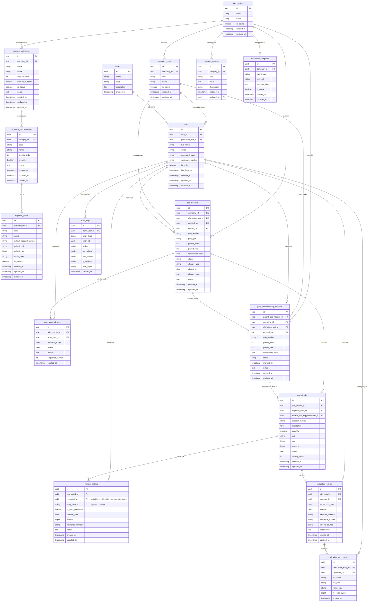

# Entity Relationship Diagram & Data Dictionary
# Sistem Dana Operasional Kebun (PDO)
# PT Barumun Palma Nauli

---

| Atribut | Detail |
|---|---|
| Versi | 1.2 — Patch transfer_entries: recorded_by nullable untuk entri otomatis sistem |
| Tanggal | 18 Juni 2026 |
| Referensi PRD | v1.7 |
| Referensi BRD | v1.1 |
| Database | PostgreSQL 15+ |

---

## Daftar Isi

1. Entity Relationship Diagram (Mermaid)
2. Data Dictionary
3. SQL DDL
4. Index Recommendations
5. Catatan Desain

---

## Bagian 1: Entity Relationship Diagram



---

## Bagian 2: Data Dictionary

### 2.1 Tabel: `companies`

Menyimpan data perusahaan. Pada implementasi awal hanya ada satu perusahaan (PT Barumun Palma Nauli), namun desain multi-tenant dibuat dari awal untuk skalabilitas.

| Nama Kolom | Tipe Data | Nullable | Default | Constraint | Deskripsi |
|---|---|---|---|---|---|
| id | UUID | NO | gen_random_uuid() | PK | Identifikasi unik perusahaan |
| code | VARCHAR(20) | NO | — | UNIQUE, NOT NULL | Kode singkat perusahaan (misal: BPN) |
| name | VARCHAR(255) | NO | — | NOT NULL | Nama lengkap perusahaan |
| is_active | BOOLEAN | NO | TRUE | NOT NULL | Status aktif perusahaan |
| created_at | TIMESTAMPTZ | NO | now() | NOT NULL | Waktu dibuat |
| updated_at | TIMESTAMPTZ | NO | now() | NOT NULL | Waktu terakhir diperbarui |

---

### 2.2 Tabel: `plantation_units`

Menyimpan data unit kebun dan unit kantor pusat. Setiap unit terhubung ke satu perusahaan. Unit dengan kode `HO` (Head Office) adalah unit khusus untuk pengguna lintas unit.

| Nama Kolom | Tipe Data | Nullable | Default | Constraint | Deskripsi |
|---|---|---|---|---|---|
| id | UUID | NO | gen_random_uuid() | PK | Identifikasi unik unit |
| company_id | UUID | NO | — | FK → companies.id, NOT NULL | Perusahaan pemilik unit |
| code | VARCHAR(10) | NO | — | UNIQUE, NOT NULL | Kode unit resmi (HO, KP, BN, JM, SS). `HO` = Head Office (lintas unit) |
| name | VARCHAR(255) | NO | — | NOT NULL | Nama unit kebun |
| is_active | BOOLEAN | NO | TRUE | NOT NULL | Status aktif unit |
| created_at | TIMESTAMPTZ | NO | now() | NOT NULL | Waktu dibuat |
| updated_at | TIMESTAMPTZ | NO | now() | NOT NULL | Waktu terakhir diperbarui |

---

### 2.3 Tabel: `roles`

Menyimpan daftar peran yang tersedia dalam sistem. Data bersifat statis (seeded saat inisialisasi).

| Nama Kolom | Tipe Data | Nullable | Default | Constraint | Deskripsi |
|---|---|---|---|---|---|
| id | UUID | NO | gen_random_uuid() | PK | Identifikasi unik role |
| name | VARCHAR(100) | NO | — | UNIQUE, NOT NULL | Nama role (misal: Kerani, Asisten Kebun) |
| code | VARCHAR(50) | NO | — | UNIQUE, NOT NULL | Kode role untuk kebutuhan programatik (misal: KERANI, ASISTEN) |
| description | TEXT | YES | NULL | — | Deskripsi tanggung jawab role |
| created_at | TIMESTAMPTZ | NO | now() | NOT NULL | Waktu dibuat |

**Nilai `code` yang valid:** `ADMIN`, `KERANI`, `ASISTEN_KEBUN`, `MANAJER_KEBUN`, `MANAJER_KEUANGAN`, `STAFF_KEUANGAN`, `DIREKTUR_KEUANGAN`, `STAFF_PURCHASING`

---

### 2.4 Tabel: `users`

Menyimpan akun pengguna sistem. Setiap user memiliki tepat satu role. Kerani dan Asisten Kebun wajib terhubung ke satu unit kebun; role lintas unit (Manajer Kebun, Manajer Keuangan, dll.) di-assign ke unit HO (Head Office).

| Nama Kolom | Tipe Data | Nullable | Default | Constraint | Deskripsi |
|---|---|---|---|---|---|
| id | UUID | NO | gen_random_uuid() | PK | Identifikasi unik user |
| role_id | UUID | NO | — | FK → roles.id, NOT NULL | Role yang dipegang user |
| plantation_unit_id | UUID | YES | NULL | FK → plantation_units.id | Unit tempat user bertugas. Kerani/Asisten wajib ke unit kebun; role lintas unit di-assign ke unit HO |
| full_name | VARCHAR(255) | NO | — | NOT NULL | Nama lengkap user |
| email | VARCHAR(255) | NO | — | UNIQUE, NOT NULL | Email untuk login |
| password_hash | VARCHAR(255) | NO | — | NOT NULL | Hasil bcrypt/Argon2 dari password |
| whatsapp_number | VARCHAR(20) | NO | — | NOT NULL | Nomor WhatsApp format internasional tanpa + (misal: 628123456789) |
| is_active | BOOLEAN | NO | TRUE | NOT NULL | Status aktif akun |
| last_login_at | TIMESTAMPTZ | YES | NULL | — | Waktu login terakhir |
| created_at | TIMESTAMPTZ | NO | now() | NOT NULL | Waktu dibuat |
| updated_at | TIMESTAMPTZ | NO | now() | NOT NULL | Waktu terakhir diperbarui |
| deleted_at | TIMESTAMPTZ | YES | NULL | — | Soft delete: diisi saat user dinonaktifkan permanen |

---

### 2.5 Tabel: `expense_categories`

Menyimpan Kategori Biaya level pertama dari hierarki master data biaya (misal: A - Gaji Staff, E - Divisi Traksi).

| Nama Kolom | Tipe Data | Nullable | Default | Constraint | Deskripsi |
|---|---|---|---|---|---|
| id | UUID | NO | gen_random_uuid() | PK | Identifikasi unik kategori |
| company_id | UUID | NO | — | FK → companies.id, NOT NULL | Perusahaan pemilik kategori |
| code | VARCHAR(20) | NO | — | UNIQUE per company, NOT NULL | Kode unik kategori (misal: A, B, E) |
| name | VARCHAR(255) | NO | — | NOT NULL | Nama kategori |
| display_order | INTEGER | NO | 0 | NOT NULL | Urutan tampil pada daftar dan laporan |
| include_in_recap | BOOLEAN | NO | TRUE | NOT NULL | Apakah kategori masuk dalam rekapitulasi PDO |
| is_active | BOOLEAN | NO | TRUE | NOT NULL | Status aktif. False = nonaktif (soft delete fungsional) |
| notes | TEXT | YES | NULL | — | Catatan opsional |
| created_at | TIMESTAMPTZ | NO | now() | NOT NULL | Waktu dibuat |
| updated_at | TIMESTAMPTZ | NO | now() | NOT NULL | Waktu terakhir diperbarui |
| deleted_at | TIMESTAMPTZ | YES | NULL | — | Soft delete permanen (NULL = aktif atau nonaktif biasa) |

---

### 2.6 Tabel: `expense_subcategories`

Menyimpan Sub-Kategori Biaya level kedua (misal: Staff Kebun, Pegawai Kantor, Operasional Kendaraan). Setiap sub-kategori terikat ke tepat satu kategori induk.

| Nama Kolom | Tipe Data | Nullable | Default | Constraint | Deskripsi |
|---|---|---|---|---|---|
| id | UUID | NO | gen_random_uuid() | PK | Identifikasi unik sub-kategori |
| category_id | UUID | NO | — | FK → expense_categories.id, NOT NULL | Kategori induk |
| code | VARCHAR(20) | NO | — | UNIQUE per category, NOT NULL | Kode unik dalam scope kategori induk |
| name | VARCHAR(255) | NO | — | NOT NULL | Nama sub-kategori |
| display_order | INTEGER | NO | 0 | NOT NULL | Urutan tampil |
| is_active | BOOLEAN | NO | TRUE | NOT NULL | Status aktif |
| notes | TEXT | YES | NULL | — | Catatan opsional |
| created_at | TIMESTAMPTZ | NO | now() | NOT NULL | Waktu dibuat |
| updated_at | TIMESTAMPTZ | NO | now() | NOT NULL | Waktu terakhir diperbarui |
| deleted_at | TIMESTAMPTZ | YES | NULL | — | Soft delete permanen |

---

### 2.7 Tabel: `expense_items`

Menyimpan Item Biaya level ketiga (misal: Gaji Manager, BBM Solar, Upah Supir). Atribut item di-snapshot ke `pdo_details` saat digunakan agar perubahan master tidak memengaruhi PDO lama.

| Nama Kolom | Tipe Data | Nullable | Default | Constraint | Deskripsi |
|---|---|---|---|---|---|
| id | UUID | NO | gen_random_uuid() | PK | Identifikasi unik item biaya |
| subcategory_id | UUID | NO | — | FK → expense_subcategories.id, NOT NULL | Sub-kategori induk |
| code | VARCHAR(30) | NO | — | UNIQUE per subcategory, NOT NULL | Kode unik dalam scope sub-kategori |
| name | VARCHAR(255) | NO | — | NOT NULL | Nama item biaya |
| default_account_number | VARCHAR(50) | YES | NULL | — | Nomor akun default dari chart of accounts |
| default_unit | VARCHAR(50) | YES | NULL | — | Satuan default (misal: Liter, Orang, Bulan) |
| default_rate | BIGINT | YES | NULL | CHECK >= 0 | Tarif default dalam satuan Rupiah |
| mode_input | VARCHAR(20) | NO | 'manual' | CHECK IN ('manual','auto_external') | Cara pengisian nilai di form PDO |
| is_routine | BOOLEAN | NO | FALSE | NOT NULL | Jika TRUE, item masuk template PDO Bulanan otomatis |
| is_active | BOOLEAN | NO | TRUE | NOT NULL | Status aktif |
| notes | TEXT | YES | NULL | — | Catatan opsional |
| created_at | TIMESTAMPTZ | NO | now() | NOT NULL | Waktu dibuat |
| updated_at | TIMESTAMPTZ | NO | now() | NOT NULL | Waktu terakhir diperbarui |
| deleted_at | TIMESTAMPTZ | YES | NULL | — | Soft delete: diisi jika item sudah dipakai di PDO dan tidak bisa hard delete |

---

### 2.8 Tabel: `system_settings`

Menyimpan konfigurasi sistem yang dapat diubah Admin tanpa deployment ulang, termasuk threshold global dan konfigurasi WhatsApp gateway.

| Nama Kolom | Tipe Data | Nullable | Default | Constraint | Deskripsi |
|---|---|---|---|---|---|
| id | UUID | NO | gen_random_uuid() | PK | Identifikasi unik setting |
| company_id | UUID | NO | — | FK → companies.id | Perusahaan pemilik setting |
| key | VARCHAR(100) | NO | — | UNIQUE per company, NOT NULL | Kunci setting (misal: threshold_proof_amount, wa_gateway_url) |
| value | TEXT | NO | — | NOT NULL | Nilai setting (disimpan sebagai text; casting dilakukan di aplikasi) |
| description | VARCHAR(255) | YES | NULL | — | Deskripsi kegunaan setting |
| updated_at | TIMESTAMPTZ | NO | now() | NOT NULL | Waktu terakhir diperbarui |
| updated_by | UUID | YES | NULL | FK → users.id | User yang terakhir mengubah |

**Key yang pre-defined:**
- `threshold_proof_amount` — nominal threshold wajib bukti (default: 1000000)
- `threshold_explanation_amount` — nominal threshold wajib penjelasan selisih (default: 500000)
- `wa_gateway_url` — URL endpoint WhatsApp gateway
- `wa_gateway_username` — Username Basic Auth WhatsApp gateway
- `wa_gateway_password` — Password Basic Auth (disimpan terenkripsi di level aplikasi)
- `reminder_day_of_month` — tanggal pengiriman reminder bulanan (default: 1)
- `reminder_hour` — jam pengiriman reminder (default: 8)

---

### 2.9 Tabel: `pdo_headers`

Header utama PDO Bulanan. Menyimpan metadata tingkat PDO: siapa yang membuat, unit mana, periode mana, dan status saat ini dalam lifecycle.

| Nama Kolom | Tipe Data | Nullable | Default | Constraint | Deskripsi |
|---|---|---|---|---|---|
| id | UUID | NO | gen_random_uuid() | PK | Identifikasi unik PDO |
| company_id | UUID | NO | — | FK → companies.id, NOT NULL | Perusahaan |
| plantation_unit_id | UUID | NO | — | FK → plantation_units.id, NOT NULL | Unit kebun pengaju |
| created_by | UUID | NO | — | FK → users.id, NOT NULL | Kerani yang membuat PDO |
| closed_by | UUID | YES | NULL | FK → users.id | User yang menutup PDO (NULL = ditutup otomatis oleh sistem) |
| pdo_number | VARCHAR(50) | NO | — | UNIQUE, NOT NULL | Nomor PDO otomatis (format: PDO-YYYY-MM-KP-001) |
| period_month | SMALLINT | NO | — | NOT NULL, CHECK(1..12) | Bulan periode (1–12) |
| period_year | SMALLINT | NO | — | NOT NULL, CHECK(2020..2099) | Tahun periode |
| submission_date | DATE | YES | NULL | — | Tanggal pengajuan resmi (diisi saat submit) |
| status | VARCHAR(30) | NO | 'draft' | NOT NULL, CHECK IN (...) | Status lifecycle PDO |
| closure_type | VARCHAR(10) | YES | NULL | CHECK IN ('system','manual') | Cara penutupan PDO. NULL jika belum closed |
| closed_at | DATE | YES | NULL | — | Tanggal PDO ditutup |
| closure_notes | TEXT | YES | NULL | — | Catatan penutupan (opsional, hanya untuk penutupan manual) |
| notes | TEXT | YES | NULL | — | Catatan umum PDO |
| created_at | TIMESTAMPTZ | NO | now() | NOT NULL | Waktu dibuat |
| updated_at | TIMESTAMPTZ | NO | now() | NOT NULL | Waktu terakhir diperbarui |

**Nilai `status` yang valid:** `draft`, `submitted`, `reviewed_asisten`, `in_review_manager`, `in_review_direktur`, `final`, `closed`

**UNIQUE constraint:** `(plantation_unit_id, period_month, period_year)` — mencegah duplikasi PDO Bulanan per unit per periode.

---

### 2.10 Tabel: `pdo_details`

Setiap baris item biaya dalam satu PDO. Tarif, nomor akun, satuan, dan nama item di-snapshot saat insert sehingga perubahan master data tidak memengaruhi PDO yang sudah ada.

| Nama Kolom | Tipe Data | Nullable | Default | Constraint | Deskripsi |
|---|---|---|---|---|---|
| id | UUID | NO | gen_random_uuid() | PK | Identifikasi unik baris PDO |
| pdo_header_id | UUID | NO | — | FK → pdo_headers.id, ON DELETE CASCADE, NOT NULL | PDO induk (Bulanan) |
| expense_item_id | UUID | NO | — | FK → expense_items.id, NOT NULL | Referensi ke master item biaya |
| source_pdo_supplementary_id | UUID | YES | NULL | FK → pdo_supplementary_headers.id | Diisi jika baris ini berasal dari merger PDO Tambahan. NULL = baris asli PDO Bulanan |
| account_number | VARCHAR(50) | YES | NULL | — | Snapshot nomor akun saat item dipilih |
| description | TEXT | NO | — | NOT NULL | Keterangan biaya (wajib diisi Kerani) |
| quantity | NUMERIC(10,2) | YES | NULL | CHECK >= 0 | Kuantitas (opsional) |
| unit | VARCHAR(50) | YES | NULL | — | Snapshot satuan saat item dipilih |
| rate | BIGINT | YES | NULL | CHECK >= 0 | Snapshot tarif saat item dipilih (Rupiah) |
| amount | BIGINT | NO | 0 | NOT NULL, CHECK >= 0 | Jumlah pengajuan dalam Rupiah (satu kolom, menggantikan Remisi I/II) |
| notes | TEXT | YES | NULL | — | Catatan tambahan per baris |
| display_order | INTEGER | NO | 0 | NOT NULL | Urutan tampil baris dalam tabel |
| created_at | TIMESTAMPTZ | NO | now() | NOT NULL | Waktu dibuat |
| updated_at | TIMESTAMPTZ | NO | now() | NOT NULL | Waktu terakhir diperbarui |

---

### 2.11 Tabel: `pdo_approval_logs`

Mencatat setiap aksi approve atau reject oleh setiap approver, secara kronologis. Tabel ini adalah sumber kebenaran untuk Approval Timeline.

| Nama Kolom | Tipe Data | Nullable | Default | Constraint | Deskripsi |
|---|---|---|---|---|---|
| id | UUID | NO | gen_random_uuid() | PK | Identifikasi unik log |
| pdo_header_id | UUID | NO | — | FK → pdo_headers.id, ON DELETE CASCADE, NOT NULL | PDO yang di-approve/reject |
| actor_user_id | UUID | NO | — | FK → users.id, NOT NULL | User yang melakukan aksi |
| approval_stage | VARCHAR(50) | NO | — | NOT NULL | Tahap approval (misal: asisten, manajer_kebun, manajer_keuangan, direktur) |
| action | VARCHAR(20) | NO | — | NOT NULL, CHECK IN ('approve','reject','submit','resubmit','close') | Jenis aksi yang dilakukan |
| reason | TEXT | YES | NULL | — | Alasan (wajib diisi jika action = reject) |
| sequence_number | INTEGER | NO | — | NOT NULL | Nomor urut aksi dalam keseluruhan timeline PDO ini (auto-increment per PDO) |
| created_at | TIMESTAMPTZ | NO | now() | NOT NULL | Waktu aksi dilakukan |

---

### 2.12 Tabel: `pdo_supplementary_headers`

Header PDO Tambahan. Setiap PDO Tambahan terhubung ke PDO Bulanan induknya. Setelah disetujui Direktur dan di-merge, item-itemnya masuk ke `pdo_details` dengan `source_pdo_supplementary_id` diisi.

| Nama Kolom | Tipe Data | Nullable | Default | Constraint | Deskripsi |
|---|---|---|---|---|---|
| id | UUID | NO | gen_random_uuid() | PK | Identifikasi unik PDO Tambahan |
| parent_pdo_header_id | UUID | NO | — | FK → pdo_headers.id, NOT NULL | PDO Bulanan induk |
| company_id | UUID | NO | — | FK → companies.id, NOT NULL | Perusahaan |
| plantation_unit_id | UUID | NO | — | FK → plantation_units.id, NOT NULL | Unit kebun pengaju |
| created_by | UUID | NO | — | FK → users.id, NOT NULL | Kerani yang membuat |
| pdo_number | VARCHAR(50) | NO | — | UNIQUE, NOT NULL | Nomor PDO Tambahan (format: PDOT-YYYY-MM-KP-001) |
| period_month | SMALLINT | NO | — | NOT NULL, CHECK(1..12) | Bulan periode |
| period_year | SMALLINT | NO | — | NOT NULL, CHECK(2020..2099) | Tahun periode |
| submission_date | DATE | YES | NULL | — | Tanggal pengajuan resmi |
| status | VARCHAR(30) | NO | 'draft' | NOT NULL, CHECK IN (...) | Status lifecycle PDO Tambahan |
| merged_at | TIMESTAMPTZ | YES | NULL | — | Waktu merger ke PDO Bulanan. NULL = belum di-merge |
| notes | TEXT | YES | NULL | — | Catatan umum |
| created_at | TIMESTAMPTZ | NO | now() | NOT NULL | Waktu dibuat |
| updated_at | TIMESTAMPTZ | NO | now() | NOT NULL | Waktu terakhir diperbarui |

**Nilai `status` yang valid:** `draft`, `submitted`, `reviewed_asisten`, `in_review_manager`, `in_review_direktur`, `final_merged`, `rejected`

**Catatan:** PDO Tambahan tidak memiliki status `closed` — setelah `final_merged`, PDO Tambahan sudah tidak relevan sebagai entitas terpisah.

---

### 2.13 Tabel: `transfer_entries`

Setiap entri transfer dana untuk satu baris item PDO. Satu item dapat memiliki banyak entri transfer (transfer bertahap). Total Transfer per item dihitung agregasi dari tabel ini.

**Catatan penting (UI-01):** Saat PDO pertama kali berstatus Final, sistem secara otomatis membuat satu entri transfer awal per item dengan nominal = Jumlah Pengajuan. Entri ini dibuat oleh sistem (bukan user), sehingga `recorded_by` = NULL, `entry_source` = `'system'`, dan `is_auto_generated` = TRUE. Manajer Keuangan/Staff Keuangan dapat mengedit atau menghapus entri otomatis ini jika nominal aktual berbeda.

| Nama Kolom | Tipe Data | Nullable | Default | Constraint | Deskripsi |
|---|---|---|---|---|---|
| id | UUID | NO | gen_random_uuid() | PK | Identifikasi unik entri transfer |
| pdo_detail_id | UUID | NO | — | FK → pdo_details.id, ON DELETE RESTRICT, NOT NULL | Baris item PDO yang menerima transfer |
| recorded_by | UUID | **YES** | **NULL** | FK → users.id, ON DELETE SET NULL | Manajer Keuangan atau Staff Keuangan yang mencatat. **NULL untuk entri otomatis yang dibuat sistem saat PDO Final** |
| entry_source | VARCHAR(10) | NO | `'manual'` | NOT NULL, CHECK IN ('system','manual') | Asal entri: `system` = dibuat otomatis saat PDO Final; `manual` = dicatat oleh user |
| is_auto_generated | BOOLEAN | NO | FALSE | NOT NULL | TRUE jika entri ini dibuat otomatis sistem. Memudahkan query dan tampilan badge "Auto" di UI |
| transfer_date | DATE | NO | — | NOT NULL | Tanggal transfer dilakukan. Untuk entri sistem: tanggal approval Direktur |
| amount | BIGINT | NO | — | NOT NULL, CHECK > 0 | Nominal transfer dalam Rupiah |
| reference_number | VARCHAR(100) | NO | — | NOT NULL | Nomor referensi transfer bank/rekening. Untuk entri sistem: `'AUTO-{pdo_number}-{item_code}'` |
| notes | TEXT | YES | NULL | — | Catatan. Untuk entri sistem: `'Dibuat otomatis saat PDO Final — sesuai nilai pengajuan'` |
| created_at | TIMESTAMPTZ | NO | now() | NOT NULL | Waktu entri dicatat |
| updated_at | TIMESTAMPTZ | NO | now() | NOT NULL | Waktu terakhir diperbarui (saat koreksi) |

**Aturan hapus:** Entri dengan `is_auto_generated = FALSE` tidak dapat dihapus — hanya dikoreksi via UPDATE (dicatat di audit_logs). Entri dengan `is_auto_generated = TRUE` **dapat dihapus** oleh Manajer Keuangan/Staff Keuangan jika nominal aktual berbeda — penghapusan ini juga dicatat di audit_logs.

---

### 2.14 Tabel: `realization_entries`

Setiap entri realisasi penggunaan dana untuk satu baris item PDO. Satu item dapat memiliki banyak entri realisasi (pembayaran parsial/bertahap).

| Nama Kolom | Tipe Data | Nullable | Default | Constraint | Deskripsi |
|---|---|---|---|---|---|
| id | UUID | NO | gen_random_uuid() | PK | Identifikasi unik entri realisasi |
| pdo_detail_id | UUID | NO | — | FK → pdo_details.id, ON DELETE RESTRICT, NOT NULL | Baris item PDO yang direalisasi |
| recorded_by | UUID | NO | — | FK → users.id, NOT NULL | Kerani atau Staff Purchasing yang mencatat |
| transaction_date | DATE | NO | — | NOT NULL | Tanggal transaksi terjadi |
| amount | BIGINT | NO | — | NOT NULL, CHECK > 0 | Nominal realisasi dalam Rupiah |
| payment_method | VARCHAR(20) | NO | — | NOT NULL, CHECK IN ('tunai','transfer','kas_kecil') | Metode pembayaran |
| reference_number | VARCHAR(100) | NO | — | NOT NULL | Nomor bukti transaksi (kwitansi/nota) |
| funding_source | VARCHAR(30) | NO | — | NOT NULL, CHECK IN ('kas_kebun','rekening_kebun','rekening_utama') | Sumber dana yang digunakan |
| explanation | TEXT | YES | NULL | — | Penjelasan selisih (wajib diisi jika selisih melebihi threshold) |
| created_at | TIMESTAMPTZ | NO | now() | NOT NULL | Waktu entri dicatat |
| updated_at | TIMESTAMPTZ | NO | now() | NOT NULL | Waktu terakhir diperbarui |

---

### 2.15 Tabel: `realization_attachments`

Menyimpan metadata file bukti transaksi yang diunggah. File fisiknya tersimpan di object storage (AWS S3); tabel ini hanya menyimpan path/URL dan metadata.

| Nama Kolom | Tipe Data | Nullable | Default | Constraint | Deskripsi |
|---|---|---|---|---|---|
| id | UUID | NO | gen_random_uuid() | PK | Identifikasi unik attachment |
| realization_entry_id | UUID | NO | — | FK → realization_entries.id, ON DELETE CASCADE, NOT NULL | Entri realisasi yang dilampiri |
| uploaded_by | UUID | NO | — | FK → users.id, NOT NULL | User yang mengunggah |
| file_name | VARCHAR(255) | NO | — | NOT NULL | Nama file asli |
| file_path | TEXT | NO | — | NOT NULL | Path/URL di object storage (S3) |
| mime_type | VARCHAR(100) | NO | — | NOT NULL | MIME type (application/pdf, image/jpeg, image/png) |
| file_size_bytes | BIGINT | NO | — | NOT NULL, CHECK > 0 | Ukuran file dalam bytes |
| created_at | TIMESTAMPTZ | NO | now() | NOT NULL | Waktu diunggah |

---

### 2.16 Tabel: `audit_logs`

Audit trail system-wide yang mencatat setiap perubahan data penting. Bersifat append-only — tidak ada UPDATE atau DELETE. Data di tabel ini tidak pernah dimodifikasi setelah insert.

| Nama Kolom | Tipe Data | Nullable | Default | Constraint | Deskripsi |
|---|---|---|---|---|---|
| id | UUID | NO | gen_random_uuid() | PK | Identifikasi unik log |
| actor_user_id | UUID | YES | NULL | FK → users.id | User yang melakukan aksi. NULL untuk aksi sistem (scheduled jobs) |
| entity_type | VARCHAR(100) | NO | — | NOT NULL | Nama tabel/entitas yang berubah (misal: pdo_headers, transfer_entries) |
| entity_id | UUID | NO | — | NOT NULL | ID rekord yang berubah |
| action | VARCHAR(50) | NO | — | NOT NULL | Jenis aksi: INSERT, UPDATE, DELETE, STATUS_CHANGE, CLOSE |
| old_values | JSONB | YES | NULL | — | Nilai sebelum perubahan (NULL untuk INSERT) |
| new_values | JSONB | YES | NULL | — | Nilai setelah perubahan (NULL untuk DELETE) |
| ip_address | INET | YES | NULL | — | IP address asal request |
| user_agent | TEXT | YES | NULL | — | Browser/client user agent |
| created_at | TIMESTAMPTZ | NO | now() | NOT NULL | Waktu aksi terjadi |

---

### 2.17 Tabel: `notification_templates`

Menyimpan template pesan WhatsApp per jenis event yang dapat dikonfigurasi Admin.

| Nama Kolom | Tipe Data | Nullable | Default | Constraint | Deskripsi |
|---|---|---|---|---|---|
| id | UUID | NO | gen_random_uuid() | PK | Identifikasi unik template |
| company_id | UUID | NO | — | FK → companies.id, NOT NULL | Perusahaan pemilik template |
| event_type | VARCHAR(100) | NO | — | NOT NULL | Jenis event (misal: pdo_submitted, pdo_rejected, sla_reminder, monthly_reminder) |
| channel | VARCHAR(20) | NO | — | NOT NULL, CHECK IN ('whatsapp','in_system') | Channel notifikasi |
| template_body | TEXT | NO | — | NOT NULL | Isi template dengan variabel dinamis ({{nama_user}}, {{nomor_pdo}}, dll.) |
| is_active | BOOLEAN | NO | TRUE | NOT NULL | Status aktif template |
| created_at | TIMESTAMPTZ | NO | now() | NOT NULL | Waktu dibuat |
| updated_at | TIMESTAMPTZ | NO | now() | NOT NULL | Waktu terakhir diperbarui |

---

## Bagian 3: SQL DDL (PostgreSQL)

```sql
-- ============================================================
-- EKSTENSI
-- ============================================================
CREATE EXTENSION IF NOT EXISTS "pgcrypto";

-- ============================================================
-- 1. COMPANIES
-- ============================================================
CREATE TABLE companies (
    id          UUID PRIMARY KEY DEFAULT gen_random_uuid(),
    code        VARCHAR(20)  NOT NULL,
    name        VARCHAR(255) NOT NULL,
    is_active   BOOLEAN      NOT NULL DEFAULT TRUE,
    created_at  TIMESTAMPTZ  NOT NULL DEFAULT now(),
    updated_at  TIMESTAMPTZ  NOT NULL DEFAULT now(),
    CONSTRAINT uq_companies_code UNIQUE (code)
);

COMMENT ON TABLE  companies            IS 'Data perusahaan. Multi-tenant ready.';
COMMENT ON COLUMN companies.code       IS 'Kode singkat perusahaan, unik global.';
COMMENT ON COLUMN companies.is_active  IS 'FALSE = perusahaan dinonaktifkan dari sistem.';


-- ============================================================
-- 2. PLANTATION_UNITS
-- ============================================================
CREATE TABLE plantation_units (
    id          UUID PRIMARY KEY DEFAULT gen_random_uuid(),
    company_id  UUID         NOT NULL REFERENCES companies(id) ON DELETE RESTRICT,
    code        VARCHAR(10)  NOT NULL,
    name        VARCHAR(255) NOT NULL,
    is_active   BOOLEAN      NOT NULL DEFAULT TRUE,
    created_at  TIMESTAMPTZ  NOT NULL DEFAULT now(),
    updated_at  TIMESTAMPTZ  NOT NULL DEFAULT now(),
    CONSTRAINT uq_plantation_units_code UNIQUE (code)
);

COMMENT ON TABLE  plantation_units              IS 'Unit kebun dan HO (Head Office). HO adalah unit lintas unit untuk Manajer, Direktur, Staff. Setiap unit milik satu perusahaan.';
COMMENT ON COLUMN plantation_units.code         IS 'Kode resmi unit: HO (Head Office/lintas unit), KP, BN, JM, SS.';
COMMENT ON COLUMN plantation_units.company_id   IS 'FK ke perusahaan pemilik unit kebun.';


-- ============================================================
-- 3. ROLES
-- ============================================================
CREATE TABLE roles (
    id          UUID PRIMARY KEY DEFAULT gen_random_uuid(),
    name        VARCHAR(100) NOT NULL,
    code        VARCHAR(50)  NOT NULL,
    description TEXT,
    created_at  TIMESTAMPTZ  NOT NULL DEFAULT now(),
    CONSTRAINT uq_roles_name UNIQUE (name),
    CONSTRAINT uq_roles_code UNIQUE (code)
);

COMMENT ON TABLE  roles      IS 'Daftar role statis. Di-seed saat inisialisasi sistem.';
COMMENT ON COLUMN roles.code IS 'Kode programatik: ADMIN, KERANI, ASISTEN_KEBUN, MANAJER_KEBUN, MANAJER_KEUANGAN, STAFF_KEUANGAN, DIREKTUR_KEUANGAN, STAFF_PURCHASING.';


-- ============================================================
-- 4. USERS
-- ============================================================
CREATE TABLE users (
    id                  UUID PRIMARY KEY DEFAULT gen_random_uuid(),
    role_id             UUID         NOT NULL REFERENCES roles(id) ON DELETE RESTRICT,
    plantation_unit_id  UUID         REFERENCES plantation_units(id) ON DELETE RESTRICT,
    full_name           VARCHAR(255) NOT NULL,
    email               VARCHAR(255) NOT NULL,
    password_hash       VARCHAR(255) NOT NULL,
    whatsapp_number     VARCHAR(20)  NOT NULL,
    is_active           BOOLEAN      NOT NULL DEFAULT TRUE,
    last_login_at       TIMESTAMPTZ,
    created_at          TIMESTAMPTZ  NOT NULL DEFAULT now(),
    updated_at          TIMESTAMPTZ  NOT NULL DEFAULT now(),
    deleted_at          TIMESTAMPTZ,
    CONSTRAINT uq_users_email UNIQUE (email)
);

COMMENT ON TABLE  users                        IS 'Akun pengguna sistem. Satu role per user.';
COMMENT ON COLUMN users.plantation_unit_id     IS 'Unit HO untuk role lintas unit (Manajer Kebun, dll.). Wajib ke unit kebun (bukan HO) untuk Kerani dan Asisten Kebun.';
COMMENT ON COLUMN users.whatsapp_number        IS 'Format internasional tanpa +, contoh: 628123456789. Digunakan untuk notifikasi WhatsApp.';
COMMENT ON COLUMN users.deleted_at             IS 'Soft delete. NULL = aktif atau nonaktif (is_active=false). Terisi = dihapus permanen.';


-- ============================================================
-- 5. EXPENSE_CATEGORIES
-- ============================================================
CREATE TABLE expense_categories (
    id               UUID PRIMARY KEY DEFAULT gen_random_uuid(),
    company_id       UUID         NOT NULL REFERENCES companies(id) ON DELETE RESTRICT,
    code             VARCHAR(20)  NOT NULL,
    name             VARCHAR(255) NOT NULL,
    display_order    INTEGER      NOT NULL DEFAULT 0,
    include_in_recap BOOLEAN      NOT NULL DEFAULT TRUE,
    is_active        BOOLEAN      NOT NULL DEFAULT TRUE,
    notes            TEXT,
    created_at       TIMESTAMPTZ  NOT NULL DEFAULT now(),
    updated_at       TIMESTAMPTZ  NOT NULL DEFAULT now(),
    deleted_at       TIMESTAMPTZ,
    CONSTRAINT uq_expense_categories_code UNIQUE (company_id, code)
);

COMMENT ON TABLE  expense_categories                  IS 'Kategori Biaya level 1. Hierarki: Kategori → Sub-Kategori → Item.';
COMMENT ON COLUMN expense_categories.include_in_recap IS 'Jika FALSE, kategori tidak masuk tabel rekapitulasi PDO.';
COMMENT ON COLUMN expense_categories.deleted_at       IS 'Soft delete permanen. Kategori yang pernah dipakai tidak bisa hard delete.';


-- ============================================================
-- 6. EXPENSE_SUBCATEGORIES
-- ============================================================
CREATE TABLE expense_subcategories (
    id            UUID PRIMARY KEY DEFAULT gen_random_uuid(),
    category_id   UUID         NOT NULL REFERENCES expense_categories(id) ON DELETE RESTRICT,
    code          VARCHAR(20)  NOT NULL,
    name          VARCHAR(255) NOT NULL,
    display_order INTEGER      NOT NULL DEFAULT 0,
    is_active     BOOLEAN      NOT NULL DEFAULT TRUE,
    notes         TEXT,
    created_at    TIMESTAMPTZ  NOT NULL DEFAULT now(),
    updated_at    TIMESTAMPTZ  NOT NULL DEFAULT now(),
    deleted_at    TIMESTAMPTZ,
    CONSTRAINT uq_expense_subcategories_code UNIQUE (category_id, code)
);

COMMENT ON TABLE  expense_subcategories            IS 'Sub-Kategori Biaya level 2. Setiap sub-kategori milik tepat satu kategori.';
COMMENT ON COLUMN expense_subcategories.deleted_at IS 'Soft delete permanen jika sub-kategori sudah pernah dipakai di PDO.';


-- ============================================================
-- 7. EXPENSE_ITEMS
-- ============================================================
CREATE TABLE expense_items (
    id                     UUID PRIMARY KEY DEFAULT gen_random_uuid(),
    subcategory_id         UUID         NOT NULL REFERENCES expense_subcategories(id) ON DELETE RESTRICT,
    code                   VARCHAR(30)  NOT NULL,
    name                   VARCHAR(255) NOT NULL,
    default_account_number VARCHAR(50),
    default_unit           VARCHAR(50),
    default_rate           BIGINT       CHECK (default_rate >= 0),
    mode_input             VARCHAR(20)  NOT NULL DEFAULT 'manual'
                               CHECK (mode_input IN ('manual', 'auto_external')),
    is_routine             BOOLEAN      NOT NULL DEFAULT FALSE,
    is_active              BOOLEAN      NOT NULL DEFAULT TRUE,
    notes                  TEXT,
    created_at             TIMESTAMPTZ  NOT NULL DEFAULT now(),
    updated_at             TIMESTAMPTZ  NOT NULL DEFAULT now(),
    deleted_at             TIMESTAMPTZ,
    CONSTRAINT uq_expense_items_code UNIQUE (subcategory_id, code)
);

COMMENT ON TABLE  expense_items                  IS 'Item Biaya level 3. Atribut di-snapshot ke pdo_details saat digunakan.';
COMMENT ON COLUMN expense_items.mode_input       IS 'manual: Kerani mengisi langsung. auto_external: nilai diambil dari aplikasi eksternal via fetchExternalCost().';
COMMENT ON COLUMN expense_items.is_routine       IS 'TRUE = item masuk template PDO Bulanan secara otomatis saat PDO baru dibuat.';
COMMENT ON COLUMN expense_items.default_rate     IS 'Tarif default dalam satuan Rupiah (bilangan bulat). Di-snapshot ke pdo_details.rate saat insert.';
COMMENT ON COLUMN expense_items.deleted_at       IS 'Soft delete. Item yang sudah dipakai di PDO tidak bisa hard delete.';


-- ============================================================
-- 8. SYSTEM_SETTINGS
-- ============================================================
CREATE TABLE system_settings (
    id          UUID PRIMARY KEY DEFAULT gen_random_uuid(),
    company_id  UUID         NOT NULL REFERENCES companies(id) ON DELETE CASCADE,
    key         VARCHAR(100) NOT NULL,
    value       TEXT         NOT NULL,
    description VARCHAR(255),
    updated_at  TIMESTAMPTZ  NOT NULL DEFAULT now(),
    updated_by  UUID         REFERENCES users(id) ON DELETE SET NULL,
    CONSTRAINT uq_system_settings_key UNIQUE (company_id, key)
);

COMMENT ON TABLE  system_settings             IS 'Konfigurasi sistem yang dapat diubah Admin tanpa deploy ulang.';
COMMENT ON COLUMN system_settings.key         IS 'Kunci setting. Contoh: threshold_proof_amount, wa_gateway_url, wa_gateway_username, wa_gateway_password.';
COMMENT ON COLUMN system_settings.value       IS 'Nilai disimpan sebagai TEXT. Casting ke tipe yang tepat dilakukan di lapisan aplikasi. API key disimpan terenkripsi.';


-- ============================================================
-- 9. PDO_HEADERS
-- ============================================================
CREATE TABLE pdo_headers (
    id                  UUID PRIMARY KEY DEFAULT gen_random_uuid(),
    company_id          UUID        NOT NULL REFERENCES companies(id) ON DELETE RESTRICT,
    plantation_unit_id  UUID        NOT NULL REFERENCES plantation_units(id) ON DELETE RESTRICT,
    created_by          UUID        NOT NULL REFERENCES users(id) ON DELETE RESTRICT,
    closed_by           UUID        REFERENCES users(id) ON DELETE SET NULL,
    pdo_number          VARCHAR(50) NOT NULL,
    period_month        SMALLINT    NOT NULL CHECK (period_month BETWEEN 1 AND 12),
    period_year         SMALLINT    NOT NULL CHECK (period_year BETWEEN 2020 AND 2099),
    submission_date     DATE,
    status              VARCHAR(30) NOT NULL DEFAULT 'draft'
                            CHECK (status IN (
                                'draft','submitted','reviewed_asisten',
                                'in_review_manager','in_review_direktur',
                                'final','closed'
                            )),
    closure_type        VARCHAR(10) CHECK (closure_type IN ('system', 'manual')),
    closed_at           DATE,
    closure_notes       TEXT,
    notes               TEXT,
    created_at          TIMESTAMPTZ NOT NULL DEFAULT now(),
    updated_at          TIMESTAMPTZ NOT NULL DEFAULT now(),
    CONSTRAINT uq_pdo_headers_number       UNIQUE (pdo_number),
    CONSTRAINT uq_pdo_headers_unit_period  UNIQUE (plantation_unit_id, period_month, period_year)
);

COMMENT ON TABLE  pdo_headers                       IS 'Header PDO Bulanan. Satu PDO per unit per periode (UNIQUE constraint).';
COMMENT ON COLUMN pdo_headers.status                IS 'Lifecycle: draft → submitted → reviewed_asisten → in_review_manager → in_review_direktur → final → closed.';
COMMENT ON COLUMN pdo_headers.closure_type          IS 'system = ditutup otomatis oleh scheduled job. manual = ditutup oleh Manajer Keuangan.';
COMMENT ON COLUMN pdo_headers.closed_by             IS 'NULL jika ditutup otomatis oleh sistem.';
COMMENT ON COLUMN pdo_headers.created_by            IS 'Kerani yang membuat PDO. Tidak bisa approve PDO ini sendiri.';


-- ============================================================
-- 10. PDO_SUPPLEMENTARY_HEADERS
-- ============================================================
CREATE TABLE pdo_supplementary_headers (
    id                   UUID PRIMARY KEY DEFAULT gen_random_uuid(),
    parent_pdo_header_id UUID        NOT NULL REFERENCES pdo_headers(id) ON DELETE RESTRICT,
    company_id           UUID        NOT NULL REFERENCES companies(id) ON DELETE RESTRICT,
    plantation_unit_id   UUID        NOT NULL REFERENCES plantation_units(id) ON DELETE RESTRICT,
    created_by           UUID        NOT NULL REFERENCES users(id) ON DELETE RESTRICT,
    pdo_number           VARCHAR(50) NOT NULL,
    period_month         SMALLINT    NOT NULL CHECK (period_month BETWEEN 1 AND 12),
    period_year          SMALLINT    NOT NULL CHECK (period_year BETWEEN 2020 AND 2099),
    submission_date      DATE,
    status               VARCHAR(30) NOT NULL DEFAULT 'draft'
                             CHECK (status IN (
                                 'draft','submitted','reviewed_asisten',
                                 'in_review_manager','in_review_direktur',
                                 'final_merged','rejected'
                             )),
    merged_at            TIMESTAMPTZ,
    notes                TEXT,
    created_at           TIMESTAMPTZ NOT NULL DEFAULT now(),
    updated_at           TIMESTAMPTZ NOT NULL DEFAULT now(),
    CONSTRAINT uq_pdo_supplementary_number UNIQUE (pdo_number)
);

COMMENT ON TABLE  pdo_supplementary_headers                    IS 'Header PDO Tambahan. Setelah disetujui Direktur, item-itemnya masuk ke pdo_details PDO Bulanan induk.';
COMMENT ON COLUMN pdo_supplementary_headers.parent_pdo_header_id IS 'PDO Bulanan induk. Wajib sudah berstatus final.';
COMMENT ON COLUMN pdo_supplementary_headers.merged_at          IS 'Waktu merger selesai dilakukan. NULL = belum di-merge.';
COMMENT ON COLUMN pdo_supplementary_headers.status             IS 'final_merged = sudah selesai di-merge. Tidak ada status closed untuk PDO Tambahan.';


-- ============================================================
-- 11. PDO_DETAILS
-- ============================================================
CREATE TABLE pdo_details (
    id                          UUID PRIMARY KEY DEFAULT gen_random_uuid(),
    pdo_header_id               UUID        NOT NULL REFERENCES pdo_headers(id) ON DELETE CASCADE,
    expense_item_id             UUID        NOT NULL REFERENCES expense_items(id) ON DELETE RESTRICT,
    source_pdo_supplementary_id UUID        REFERENCES pdo_supplementary_headers(id) ON DELETE RESTRICT,
    account_number              VARCHAR(50),
    description                 TEXT        NOT NULL,
    quantity                    NUMERIC(10,2) CHECK (quantity >= 0),
    unit                        VARCHAR(50),
    rate                        BIGINT      CHECK (rate >= 0),
    amount                      BIGINT      NOT NULL DEFAULT 0 CHECK (amount >= 0),
    notes                       TEXT,
    display_order               INTEGER     NOT NULL DEFAULT 0,
    created_at                  TIMESTAMPTZ NOT NULL DEFAULT now(),
    updated_at                  TIMESTAMPTZ NOT NULL DEFAULT now()
);

COMMENT ON TABLE  pdo_details                              IS 'Baris item biaya dalam PDO Bulanan. Tarif, akun, satuan di-snapshot saat insert.';
COMMENT ON COLUMN pdo_details.source_pdo_supplementary_id IS 'NULL = baris asli PDO Bulanan. Terisi = berasal dari merger PDO Tambahan ini. Jejak audit merger.';
COMMENT ON COLUMN pdo_details.account_number              IS 'Snapshot nomor akun dari master saat baris dibuat. Independen dari perubahan master.';
COMMENT ON COLUMN pdo_details.rate                        IS 'Snapshot tarif dari master saat baris dibuat. Perubahan tarif di master tidak memengaruhi nilai ini.';
COMMENT ON COLUMN pdo_details.amount                      IS 'Jumlah pengajuan dalam Rupiah. Satu kolom (menggantikan konsep Remisi I/II yang dihapus).';


-- ============================================================
-- 12. PDO_APPROVAL_LOGS
-- ============================================================
CREATE TABLE pdo_approval_logs (
    id              UUID PRIMARY KEY DEFAULT gen_random_uuid(),
    pdo_header_id   UUID        NOT NULL REFERENCES pdo_headers(id) ON DELETE CASCADE,
    actor_user_id   UUID        NOT NULL REFERENCES users(id) ON DELETE RESTRICT,
    approval_stage  VARCHAR(50) NOT NULL,
    action          VARCHAR(20) NOT NULL
                        CHECK (action IN ('submit','approve','reject','resubmit','close')),
    reason          TEXT,
    sequence_number INTEGER     NOT NULL,
    created_at      TIMESTAMPTZ NOT NULL DEFAULT now()
);

COMMENT ON TABLE  pdo_approval_logs                 IS 'Immutable log setiap aksi approval. Sumber data Approval Timeline. Append-only.';
COMMENT ON COLUMN pdo_approval_logs.approval_stage  IS 'Tahap: kerani, asisten, manajer_kebun, manajer_keuangan, direktur, system.';
COMMENT ON COLUMN pdo_approval_logs.sequence_number IS 'Nomor urut aksi dalam timeline PDO ini. Digunakan untuk replay history secara kronologis.';
COMMENT ON COLUMN pdo_approval_logs.reason          IS 'Wajib diisi untuk action=reject. NULL untuk approve/submit.';

-- Tambahan: log untuk PDO Tambahan menggunakan tabel terpisah
CREATE TABLE pdo_supplementary_approval_logs (
    id                          UUID PRIMARY KEY DEFAULT gen_random_uuid(),
    pdo_supplementary_header_id UUID        NOT NULL REFERENCES pdo_supplementary_headers(id) ON DELETE CASCADE,
    actor_user_id               UUID        NOT NULL REFERENCES users(id) ON DELETE RESTRICT,
    approval_stage              VARCHAR(50) NOT NULL,
    action                      VARCHAR(20) NOT NULL
                                    CHECK (action IN ('submit','approve','reject','resubmit')),
    reason                      TEXT,
    sequence_number             INTEGER     NOT NULL,
    created_at                  TIMESTAMPTZ NOT NULL DEFAULT now()
);

COMMENT ON TABLE pdo_supplementary_approval_logs IS 'Approval log untuk PDO Tambahan. Struktur identik dengan pdo_approval_logs.';


-- ============================================================
-- 13. TRANSFER_ENTRIES
-- ============================================================
CREATE TABLE transfer_entries (
    id               UUID PRIMARY KEY DEFAULT gen_random_uuid(),
    pdo_detail_id    UUID         NOT NULL REFERENCES pdo_details(id) ON DELETE RESTRICT,
    recorded_by      UUID         REFERENCES users(id) ON DELETE SET NULL,  -- NULL untuk entri otomatis sistem
    entry_source     VARCHAR(10)  NOT NULL DEFAULT 'manual'
                         CHECK (entry_source IN ('system', 'manual')),
    is_auto_generated BOOLEAN     NOT NULL DEFAULT FALSE,
    transfer_date    DATE         NOT NULL,
    amount           BIGINT       NOT NULL CHECK (amount > 0),
    reference_number VARCHAR(100) NOT NULL,
    notes            TEXT,
    created_at       TIMESTAMPTZ  NOT NULL DEFAULT now(),
    updated_at       TIMESTAMPTZ  NOT NULL DEFAULT now()
);

COMMENT ON TABLE  transfer_entries                    IS 'Setiap entri transfer dana per item PDO. Multiple entri diizinkan (transfer bertahap). Entri manual tidak bisa dihapus; entri otomatis (is_auto_generated=TRUE) bisa dihapus Manajer Keuangan.';
COMMENT ON COLUMN transfer_entries.recorded_by        IS 'NULL untuk entri yang dibuat otomatis sistem saat PDO Final. Terisi untuk entri manual oleh Manajer Keuangan/Staff Keuangan.';
COMMENT ON COLUMN transfer_entries.entry_source       IS 'system = dibuat otomatis saat event PDO Final; manual = dicatat oleh user.';
COMMENT ON COLUMN transfer_entries.is_auto_generated  IS 'TRUE jika dibuat sistem saat PDO Final (nominal = jumlah pengajuan). Entri ini dapat dihapus jika tidak sesuai realita.';
COMMENT ON COLUMN transfer_entries.reference_number   IS 'Nomor referensi bank. Untuk entri sistem diisi AUTO-{pdo_number}-{item_code}.';
COMMENT ON COLUMN transfer_entries.amount             IS 'Nominal transfer dalam Rupiah. Harus > 0.';


-- ============================================================
-- 14. REALIZATION_ENTRIES
-- ============================================================
CREATE TABLE realization_entries (
    id               UUID PRIMARY KEY DEFAULT gen_random_uuid(),
    pdo_detail_id    UUID        NOT NULL REFERENCES pdo_details(id) ON DELETE RESTRICT,
    recorded_by      UUID        NOT NULL REFERENCES users(id) ON DELETE RESTRICT,
    transaction_date DATE        NOT NULL,
    amount           BIGINT      NOT NULL CHECK (amount > 0),
    payment_method   VARCHAR(20) NOT NULL
                         CHECK (payment_method IN ('tunai', 'transfer', 'kas_kecil')),
    reference_number VARCHAR(100) NOT NULL,
    funding_source   VARCHAR(30) NOT NULL
                         CHECK (funding_source IN ('kas_kebun', 'rekening_kebun', 'rekening_utama')),
    explanation      TEXT,
    created_at       TIMESTAMPTZ NOT NULL DEFAULT now(),
    updated_at       TIMESTAMPTZ NOT NULL DEFAULT now()
);

COMMENT ON TABLE  realization_entries                  IS 'Setiap entri realisasi penggunaan dana per item PDO. Multiple entri diizinkan (pembayaran parsial).';
COMMENT ON COLUMN realization_entries.funding_source   IS 'kas_kebun/rekening_kebun: hanya Kerani. rekening_utama: Kerani dan Staff Purchasing. Validasi dilakukan di aplikasi.';
COMMENT ON COLUMN realization_entries.explanation      IS 'Wajib diisi jika |Total Transfer item - Total Realisasi item| > threshold global (default: Rp 500.000).';
COMMENT ON COLUMN realization_entries.amount           IS 'Nominal realisasi dalam Rupiah. Validasi kumulatif PDO (Total Realisasi PDO ≤ Total Transfer PDO) dilakukan di aplikasi sebelum INSERT.';


-- ============================================================
-- 15. REALIZATION_ATTACHMENTS
-- ============================================================
CREATE TABLE realization_attachments (
    id                    UUID PRIMARY KEY DEFAULT gen_random_uuid(),
    realization_entry_id  UUID         NOT NULL REFERENCES realization_entries(id) ON DELETE CASCADE,
    uploaded_by           UUID         NOT NULL REFERENCES users(id) ON DELETE RESTRICT,
    file_name             VARCHAR(255) NOT NULL,
    file_path             TEXT         NOT NULL,
    mime_type             VARCHAR(100) NOT NULL,
    file_size_bytes       BIGINT       NOT NULL CHECK (file_size_bytes > 0),
    created_at            TIMESTAMPTZ  NOT NULL DEFAULT now()
);

COMMENT ON TABLE  realization_attachments           IS 'Metadata file bukti transaksi. File fisik di AWS S3, database hanya menyimpan path.';
COMMENT ON COLUMN realization_attachments.file_path IS 'Path/URL di AWS S3. Format: s3://bucket-name/pdo/{pdo_id}/{entry_id}/{filename}.';
COMMENT ON COLUMN realization_attachments.mime_type IS 'Hanya menerima: application/pdf, image/jpeg, image/png. Validasi di aplikasi.';
COMMENT ON COLUMN realization_attachments.file_size_bytes IS 'Ukuran file dalam bytes. Maksimum 5.242.880 bytes (5 MB). Validasi di aplikasi.';


-- ============================================================
-- 16. AUDIT_LOGS
-- ============================================================
CREATE TABLE audit_logs (
    id              UUID PRIMARY KEY DEFAULT gen_random_uuid(),
    actor_user_id   UUID         REFERENCES users(id) ON DELETE SET NULL,
    entity_type     VARCHAR(100) NOT NULL,
    entity_id       UUID         NOT NULL,
    action          VARCHAR(50)  NOT NULL,
    old_values      JSONB,
    new_values      JSONB,
    ip_address      INET,
    user_agent      TEXT,
    created_at      TIMESTAMPTZ  NOT NULL DEFAULT now()
);

COMMENT ON TABLE  audit_logs               IS 'Audit trail system-wide. Append-only — tidak ada UPDATE atau DELETE pada tabel ini.';
COMMENT ON COLUMN audit_logs.actor_user_id IS 'NULL untuk aksi sistem (scheduled job, auto-close PDO).';
COMMENT ON COLUMN audit_logs.entity_type   IS 'Nama tabel yang berubah: pdo_headers, transfer_entries, realization_entries, expense_items, dll.';
COMMENT ON COLUMN audit_logs.old_values    IS 'JSONB nilai sebelum perubahan. NULL untuk INSERT.';
COMMENT ON COLUMN audit_logs.new_values    IS 'JSONB nilai setelah perubahan. NULL untuk DELETE.';


-- ============================================================
-- 17. NOTIFICATION_TEMPLATES
-- ============================================================
CREATE TABLE notification_templates (
    id            UUID PRIMARY KEY DEFAULT gen_random_uuid(),
    company_id    UUID         NOT NULL REFERENCES companies(id) ON DELETE CASCADE,
    event_type    VARCHAR(100) NOT NULL,
    channel       VARCHAR(20)  NOT NULL CHECK (channel IN ('whatsapp', 'in_system')),
    template_body TEXT         NOT NULL,
    is_active     BOOLEAN      NOT NULL DEFAULT TRUE,
    created_at    TIMESTAMPTZ  NOT NULL DEFAULT now(),
    updated_at    TIMESTAMPTZ  NOT NULL DEFAULT now(),
    CONSTRAINT uq_notification_templates UNIQUE (company_id, event_type, channel)
);

COMMENT ON TABLE  notification_templates            IS 'Template pesan notifikasi per event per channel. Dikonfigurasi Admin.';
COMMENT ON COLUMN notification_templates.event_type IS 'pdo_submitted, pdo_approved_asisten, pdo_approved_manager, pdo_rejected, pdo_final, sla_reminder, monthly_reminder.';
COMMENT ON COLUMN notification_templates.template_body IS 'Mendukung variabel: {{nama_user}}, {{nomor_pdo}}, {{periode}}, {{unit_kebun}}, {{alasan_reject}}, {{deadline}}, {{total_pengajuan}}.';
```

---

## Bagian 4: Index Recommendations

### 4.1 `companies`
```sql
-- Lookup perusahaan aktif (jarang berubah, tapi dipakai di hampir semua query)
CREATE INDEX idx_companies_active
    ON companies(is_active)
    WHERE is_active = TRUE;
```
> Tabel kecil (1–10 baris). Index di sini terutama untuk kelengkapan dan dokumentasi pola query.

---

### 4.2 `plantation_units`
```sql
-- Lookup unit aktif per perusahaan (dipakai di dropdown form PDO, dashboard filter)
CREATE INDEX idx_plantation_units_company_active
    ON plantation_units(company_id, is_active);

-- Lookup unit berdasarkan kode (format nomor PDO, validasi kode unit)
CREATE INDEX idx_plantation_units_code
    ON plantation_units(code);
```

---

### 4.3 `roles`
```sql
-- Lookup role berdasarkan kode (dipakai saat validasi permission di middleware)
-- UNIQUE constraint sudah membuat implicit index, tapi kita eksplisitkan untuk dokumentasi
-- CREATE UNIQUE INDEX sudah ada via CONSTRAINT uq_roles_code
-- Tidak perlu tambahan index — tabel ini sangat kecil (8 baris statis)
```
> Tabel statis 8 baris. PK dan UNIQUE constraint sudah cukup; query selalu O(1).

---

### 4.4 `users`
```sql
-- Login lookup (paling sering, partial index exclude soft-deleted)
CREATE INDEX idx_users_email
    ON users(email)
    WHERE deleted_at IS NULL;

-- Filter user aktif per unit kebun (validasi akses, notifikasi per unit)
CREATE INDEX idx_users_plantation_unit
    ON users(plantation_unit_id)
    WHERE plantation_unit_id IS NOT NULL AND is_active = TRUE;

-- Filter user aktif per role (notifikasi massal ke role tertentu, approval chain)
CREATE INDEX idx_users_role_active
    ON users(role_id, is_active)
    WHERE is_active = TRUE;

-- Lookup nomor WhatsApp (validasi duplikasi, lookup penerima notifikasi)
CREATE INDEX idx_users_whatsapp
    ON users(whatsapp_number)
    WHERE is_active = TRUE;
```

---

### 4.5 `expense_categories`
```sql
-- Dropdown kategori aktif per perusahaan (urutan tampil)
CREATE INDEX idx_expense_categories_company_active
    ON expense_categories(company_id, display_order)
    WHERE is_active = TRUE AND deleted_at IS NULL;

-- Laporan: kategori yang masuk rekap PDO
CREATE INDEX idx_expense_categories_include_recap
    ON expense_categories(company_id, include_in_recap)
    WHERE include_in_recap = TRUE AND is_active = TRUE;
```

---

### 4.6 `expense_subcategories`
```sql
-- Cascading dropdown: sub-kategori aktif per kategori (urutan tampil)
CREATE INDEX idx_expense_subcategories_category_active
    ON expense_subcategories(category_id, display_order)
    WHERE is_active = TRUE AND deleted_at IS NULL;
```

---

### 4.7 `expense_items`
```sql
-- Cascading dropdown: item aktif per sub-kategori (urutan tampil)
CREATE INDEX idx_expense_items_subcategory_active
    ON expense_items(subcategory_id, display_order)
    WHERE is_active = TRUE AND deleted_at IS NULL;

-- Template PDO Bulanan: semua item rutin aktif (dipakai setiap PDO baru dibuat)
CREATE INDEX idx_expense_items_routine
    ON expense_items(subcategory_id)
    WHERE is_routine = TRUE AND is_active = TRUE AND deleted_at IS NULL;

-- Filter item auto_external (identifikasi baris yang butuh tombol "Ambil Biaya")
CREATE INDEX idx_expense_items_mode_input
    ON expense_items(mode_input)
    WHERE mode_input = 'auto_external';
```

---

### 4.8 `system_settings`
```sql
-- Lookup setting berdasarkan key per perusahaan (dipakai setiap validasi threshold)
-- UNIQUE constraint (company_id, key) sudah membuat implicit index — cukup
-- Tidak perlu tambahan index terpisah
```
> UNIQUE constraint `uq_system_settings_key(company_id, key)` sudah menghasilkan index B-tree yang optimal untuk semua query `WHERE company_id = ? AND key = ?`.

---

### 4.9 `pdo_headers`
```sql
-- Query paling sering: daftar PDO per unit + periode (Daftar PDO, dashboard per unit)
CREATE INDEX idx_pdo_headers_unit_period
    ON pdo_headers(plantation_unit_id, period_year DESC, period_month DESC);

-- Filter status (daftar PDO, badge counter di sidebar)
CREATE INDEX idx_pdo_headers_status_unit
    ON pdo_headers(status, plantation_unit_id);

-- Lookup nomor PDO (search global)
CREATE INDEX idx_pdo_headers_number
    ON pdo_headers(pdo_number);

-- Scheduled job: PDO Final yang perlu di-close otomatis (run setiap malam)
CREATE INDEX idx_pdo_headers_final_for_close
    ON pdo_headers(period_year, period_month)
    WHERE status = 'final';

-- Dashboard konsolidasi: semua PDO per perusahaan + periode (Manajer Keuangan, Direktur)
CREATE INDEX idx_pdo_headers_company_period
    ON pdo_headers(company_id, period_year DESC, period_month DESC, status);

-- FK: created_by — lookup PDO yang dibuat satu Kerani (self-approval check)
CREATE INDEX idx_pdo_headers_created_by
    ON pdo_headers(created_by);

-- FK: closed_by — siapa yang menutup PDO (audit)
CREATE INDEX idx_pdo_headers_closed_by
    ON pdo_headers(closed_by)
    WHERE closed_by IS NOT NULL;
```

---

### 4.10 `pdo_supplementary_headers`
```sql
-- PDO Tambahan per PDO Bulanan induk (load semua PDOT untuk satu PDO Bulanan)
CREATE INDEX idx_pdo_supplementary_parent
    ON pdo_supplementary_headers(parent_pdo_header_id);

-- Filter status: PDOT yang masih aktif di Daftar PDO (belum merged)
CREATE INDEX idx_pdo_supplementary_status
    ON pdo_supplementary_headers(status, plantation_unit_id)
    WHERE status NOT IN ('final_merged');

-- Filter per unit + periode (Daftar PDO Tambahan per unit)
CREATE INDEX idx_pdo_supplementary_unit_period
    ON pdo_supplementary_headers(plantation_unit_id, period_year DESC, period_month DESC);

-- FK: created_by (self-approval check)
CREATE INDEX idx_pdo_supplementary_created_by
    ON pdo_supplementary_headers(created_by);

-- Lookup nomor PDOT (search)
CREATE INDEX idx_pdo_supplementary_number
    ON pdo_supplementary_headers(pdo_number);
```

---

### 4.11 `pdo_details`
```sql
-- Load semua baris satu PDO (query paling sering — render tabel detail PDO)
CREATE INDEX idx_pdo_details_header_order
    ON pdo_details(pdo_header_id, display_order);

-- Lookup baris berdasarkan item biaya dalam satu PDO (cek duplikasi, filter per item)
CREATE INDEX idx_pdo_details_header_item
    ON pdo_details(pdo_header_id, expense_item_id);

-- Merger tracking: baris yang berasal dari PDO Tambahan
CREATE INDEX idx_pdo_details_supplementary_source
    ON pdo_details(source_pdo_supplementary_id)
    WHERE source_pdo_supplementary_id IS NOT NULL;

-- FK: expense_item_id — validasi item masih aktif, laporan per item
CREATE INDEX idx_pdo_details_expense_item
    ON pdo_details(expense_item_id);
```

---

### 4.12 `pdo_approval_logs`
```sql
-- Timeline approval per PDO (render Approval Timeline, urutan kronologis)
CREATE INDEX idx_pdo_approval_logs_pdo_sequence
    ON pdo_approval_logs(pdo_header_id, sequence_number ASC);

-- Lookup aksi per user (siapa yang approve/reject, SLA monitoring)
CREATE INDEX idx_pdo_approval_logs_actor_date
    ON pdo_approval_logs(actor_user_id, created_at DESC);

-- Filter berdasarkan aksi (berapa banyak reject? berapa lama tiap tahap?)
CREATE INDEX idx_pdo_approval_logs_action
    ON pdo_approval_logs(pdo_header_id, action);
```

---

### 4.13 `pdo_supplementary_approval_logs`
```sql
-- Timeline approval PDOT per PDO Tambahan (kronologis)
CREATE INDEX idx_pdo_supp_approval_logs_pdo_sequence
    ON pdo_supplementary_approval_logs(pdo_supplementary_header_id, sequence_number ASC);

-- Lookup aksi per user
CREATE INDEX idx_pdo_supp_approval_logs_actor
    ON pdo_supplementary_approval_logs(actor_user_id, created_at DESC);
```

---

### 4.14 `transfer_entries`
```sql
-- Kalkulasi Total Transfer per item (SUM query — index paling kritis untuk validasi)
CREATE INDEX idx_transfer_entries_pdo_detail_date
    ON transfer_entries(pdo_detail_id, transfer_date ASC);

-- Filter entri otomatis vs manual (UI menampilkan badge "Auto" untuk is_auto_generated=TRUE)
CREATE INDEX idx_transfer_entries_auto_generated
    ON transfer_entries(pdo_detail_id, is_auto_generated);

-- Filter berdasarkan entry_source (query entri sistem untuk proses auto-create saat PDO Final)
CREATE INDEX idx_transfer_entries_source
    ON transfer_entries(entry_source)
    WHERE entry_source = 'system';

-- FK: recorded_by (riwayat transfer oleh satu user, audit)
-- Partial index: hanya untuk entri manual (recorded_by tidak NULL)
CREATE INDEX idx_transfer_entries_recorded_by
    ON transfer_entries(recorded_by)
    WHERE recorded_by IS NOT NULL;
```

---

### 4.15 `realization_entries`
```sql
-- Kalkulasi Total Realisasi per item + validasi kumulatif PDO
-- Index PALING KRITIS: dipakai pada setiap INSERT realisasi untuk SUM check
CREATE INDEX idx_realization_entries_pdo_detail_date
    ON realization_entries(pdo_detail_id, transaction_date ASC);

-- Filter berdasarkan sumber dana (tab filter "rekening_utama" untuk Staff Purchasing)
CREATE INDEX idx_realization_entries_funding_source
    ON realization_entries(pdo_detail_id, funding_source);

-- FK: recorded_by (riwayat realisasi oleh satu user, audit trail)
CREATE INDEX idx_realization_entries_recorded_by
    ON realization_entries(recorded_by);

-- Filter item yang belum ada realisasi (tab "Belum Realisasi" — NOT EXISTS query)
-- Dicover oleh idx_realization_entries_pdo_detail_date
```

---

### 4.16 `realization_attachments`
```sql
-- Semua lampiran per entri realisasi (load bukti satu transaksi)
CREATE INDEX idx_realization_attachments_entry
    ON realization_attachments(realization_entry_id);

-- FK: uploaded_by (siapa yang upload, audit)
CREATE INDEX idx_realization_attachments_uploader
    ON realization_attachments(uploaded_by);
```

---

### 4.17 `audit_logs`
```sql
-- Audit trail per entitas (lookup history satu rekord — paling sering dipakai)
CREATE INDEX idx_audit_logs_entity_date
    ON audit_logs(entity_type, entity_id, created_at DESC);

-- Audit trail per user (semua aktivitas satu user)
CREATE INDEX idx_audit_logs_actor_date
    ON audit_logs(actor_user_id, created_at DESC)
    WHERE actor_user_id IS NOT NULL;

-- Filter berdasarkan jenis aksi (berapa INSERT vs UPDATE? audit spesifik)
CREATE INDEX idx_audit_logs_action
    ON audit_logs(action, entity_type, created_at DESC);
```

---

### 4.18 `notification_templates`
```sql
-- Lookup template aktif per event + channel (dipakai setiap pengiriman notifikasi)
-- UNIQUE constraint (company_id, event_type, channel) sudah menghasilkan index ini
-- Tidak perlu tambahan index terpisah

-- Filter template aktif (load semua template yang masih digunakan)
CREATE INDEX idx_notification_templates_active
    ON notification_templates(company_id, is_active)
    WHERE is_active = TRUE;
```

---

### Ringkasan Jumlah Index per Tabel

| Tabel | Index Tambahan | Catatan |
|-------|:-:|---|
| `companies` | 1 | Tabel sangat kecil |
| `plantation_units` | 2 | |
| `roles` | 0 | 8 baris statis, UNIQUE sudah cukup |
| `users` | 4 | Termasuk partial index untuk active users |
| `expense_categories` | 2 | |
| `expense_subcategories` | 1 | |
| `expense_items` | 3 | Termasuk partial index is_routine |
| `system_settings` | 0 | UNIQUE constraint sudah optimal |
| `pdo_headers` | 7 | Tabel paling banyak di-query |
| `pdo_supplementary_headers` | 5 | |
| `pdo_details` | 4 | |
| `pdo_approval_logs` | 3 | |
| `pdo_supplementary_approval_logs` | 2 | Tabel baru — sebelumnya tidak ada index |
| `transfer_entries` | 4 | Tambah index is_auto_generated dan entry_source (patch v1.2) |
| `realization_entries` | 3 | Index SUM paling kritis |
| `realization_attachments` | 2 | |
| `audit_logs` | 3 | |
| `notification_templates` | 1 | UNIQUE sudah cover query utama |
| **Total** | **47** | Bertambah 2 dari patch v1.2 (transfer_entries) |

---

## Bagian 5: Catatan Desain

### 5.1 Mengapa UUID sebagai Primary Key?

Semua tabel menggunakan **UUID** (bukan BIGSERIAL/BIGINT) sebagai primary key. Keputusan ini diambil karena:

- **Keamanan:** UUID tidak enumerable — attacker tidak bisa menebak ID rekord lain dengan menambah/mengurangi angka. Untuk sistem keuangan ini sangat penting karena ID sering muncul di URL (misal: `/pdo/{id}`).
- **Distribusi aman:** UUID dapat dibuat di sisi aplikasi sebelum INSERT, memungkinkan idempotent operations dan offline-first patterns jika dibutuhkan di masa depan.
- **Multi-tenant ready:** UUID global unik memudahkan sharding dan migrasi data lintas database jika sistem berkembang.

Tradeoff: UUID sedikit lebih besar (16 bytes vs 8 bytes untuk BIGINT) dan index B-tree kurang optimal untuk UUID v4 yang random. Mitigasi: gunakan **UUID v7** (time-ordered) yang didukung PostgreSQL 17+ atau library seperti `ulid` untuk mempertahankan locality index. Untuk PostgreSQL 15 (target saat ini), gunakan `gen_random_uuid()` dan terima tradeoff ini — pada skala sistem ini (ratusan PDO per tahun) tidak akan menjadi bottleneck.

---

### 5.2 Desain Approval Log untuk Replay Kronologis

Tabel `pdo_approval_logs` dirancang sebagai **event store** yang append-only:

- Setiap aksi (submit, approve, reject, resubmit, close) menghasilkan satu baris baru — tidak pernah UPDATE rekord lama.
- Kolom `sequence_number` adalah counter per PDO (1, 2, 3, ...) yang diincrement oleh aplikasi setiap kali aksi baru ditambahkan. Ini memungkinkan replay history secara deterministik.
- Kolom `approval_stage` mencatat **siapa yang seharusnya bertindak** (bukan hanya siapa yang bertindak), sehingga timeline dapat menampilkan tahap yang dilewati atau diulang dengan benar.

Contoh replay timeline PDO yang pernah di-reject:
```
seq=1  stage=kerani         action=submit
seq=2  stage=asisten        action=approve
seq=3  stage=manajer_kebun  action=reject    reason="Nominal BBM terlalu besar"
seq=4  stage=kerani         action=resubmit
seq=5  stage=asisten        action=approve
seq=6  stage=manajer_kebun  action=approve
seq=7  stage=manajer_keuangan action=approve
seq=8  stage=direktur       action=approve
```

Dengan `sequence_number` dan `created_at`, aplikasi dapat me-render Approval Timeline dalam urutan yang tepat bahkan jika ada race condition pada insert.

---

### 5.3 Implementasi Snapshot Tarif

Setiap kali Kerani memilih item biaya pada form PDO, aplikasi **langsung menyalin** nilai dari master ke baris `pdo_details`:

```sql
-- Saat INSERT pdo_details:
INSERT INTO pdo_details (
    pdo_header_id, expense_item_id,
    account_number,  -- disalin dari expense_items.default_account_number
    unit,            -- disalin dari expense_items.default_unit
    rate,            -- disalin dari expense_items.default_rate
    description, amount, display_order
) VALUES (...);
```

Kolom `expense_item_id` tetap ada sebagai FK untuk keperluan referensi dan reporting (misal: "item apa ini?"), tapi nilai operasional (tarif, akun, satuan) tidak pernah di-JOIN ulang ke `expense_items` setelah insert. Perubahan `expense_items.default_rate` setelah PDO dibuat sama sekali tidak berdampak pada `pdo_details.rate` yang sudah tersimpan.

---

### 5.4 Mekanisme Merger PDO Tambahan ke PDO Bulanan

Merger diimplementasikan dengan cara **menyalin baris** dari PDO Tambahan ke `pdo_details` PDO Bulanan, bukan dengan membuat relasi/pointer. Ini memberikan konsistensi data yang lebih kuat:

**Alur merger saat Direktur approve PDO Tambahan:**
1. Aplikasi mengambil semua baris dari `pdo_details` yang ber-`pdo_header_id` = ID PDO Tambahan (yang sudah disimpan di sana sementara selama proses approval).

   *Catatan arsitektur:* Selama PDO Tambahan masih dalam approval, item-itemnya **tidak** disimpan di `pdo_details` PDO Bulanan. Item disimpan di tabel `pdo_details` dengan `pdo_header_id` yang merujuk ke PDO Bulanan HANYA setelah merge. Sebelum merge, detail PDO Tambahan disimpan di... `pdo_supplementary_details` (tabel tambahan yang perlu dibuat — lihat catatan di bawah).

2. Aplikasi INSERT baris-baris baru ke `pdo_details` dengan:
   - `pdo_header_id` = ID PDO Bulanan induk
   - `source_pdo_supplementary_id` = ID PDO Tambahan asal
   - Semua nilai lainnya disalin dari detail PDO Tambahan

3. Aplikasi UPDATE `pdo_supplementary_headers.status` = `final_merged` dan set `merged_at` = now().

**Kolom `source_pdo_supplementary_id`** pada `pdo_details` adalah jejak audit yang permanen. Dengan kolom ini, aplikasi dapat menjawab pertanyaan: "Baris item ini berasal dari PDO Tambahan mana?" tanpa perlu JOIN kompleks.

**Tabel tambahan yang dibutuhkan:** `pdo_supplementary_details` — menyimpan item-item PDO Tambahan selama proses approval berlangsung (sebelum merge). Strukturnya identik dengan `pdo_details` tetapi dengan FK ke `pdo_supplementary_headers`. Setelah merge, data di tabel ini dapat diabaikan (tidak dihapus, untuk audit).

---

### 5.5 Strategi Soft Delete vs Hard Delete

Sistem menggunakan **tiga strategi** berbeda tergantung konteks:

| Entitas | Strategi | Penjelasan |
|---------|----------|-----------|
| `expense_categories`, `expense_subcategories`, `expense_items` | **Soft delete fungsional** (`is_active = FALSE`) + **Soft delete permanen** (`deleted_at IS NOT NULL`) | `is_active = FALSE`: item masih terlihat di PDO lama, tidak muncul di dropdown baru. `deleted_at`: item sudah pernah dipakai di PDO, tidak bisa dihapus fisik sama sekali. |
| `users` | **Soft delete** (`is_active = FALSE` + `deleted_at`) | User tidak aktif tidak bisa login, namun tetap terlihat di audit log dan approval history. |
| `pdo_details`, `pdo_approval_logs`, `audit_logs` | **Tidak bisa dihapus** | Data keuangan dan audit trail bersifat immutable. `ON DELETE RESTRICT` di FK mencegah penghapusan tidak sengaja. |
| `transfer_entries` | **Dua aturan berbeda** | Entri manual (`is_auto_generated = FALSE`): tidak bisa dihapus — hanya dikoreksi via UPDATE. Entri otomatis sistem (`is_auto_generated = TRUE`): **dapat dihapus** oleh Manajer Keuangan/Staff Keuangan jika nominal aktual berbeda dari pengajuan. Semua penghapusan dicatat di `audit_logs`. |
| `realization_attachments` | **CASCADE dari realization_entries** | Jika entri realisasi dihapus (tidak boleh di produksi), attachment ikut terhapus. |

---

### 5.6 Tabel Terpisah untuk File Attachments

Ya, **file attachments dipisah ke tabel sendiri** (`realization_attachments`) dan tidak digabung ke `realization_entries`. Alasannya:

- **Satu entri realisasi dapat memiliki beberapa file** (misal: foto nota + scan invoice). Jika digabung, perlu array JSON atau kolom multi-value yang sulit di-query.
- **Metadata file** (nama, ukuran, MIME type) lebih mudah diquery dan divalidasi jika dalam tabel terpisah.
- **Presigned URL generation** lebih clean: aplikasi query `realization_attachments.file_path`, generate presigned URL dari S3, lalu kembalikan ke frontend — tanpa perlu memodifikasi `realization_entries`.
- **Deletion handling:** Jika di masa depan ada kebutuhan menghapus file spesifik (misal: salah upload), operasi terbatas pada `realization_attachments` tanpa memengaruhi data realisasi.

---

### 5.7 Tabel Tambahan yang Direkomendasikan (di luar daftar awal)

Berdasarkan kebutuhan di PRD dan BRD, berikut tabel yang perlu ditambahkan selain yang sudah didefinisikan:

**`pdo_supplementary_details`** — menyimpan item biaya PDO Tambahan selama proses approval (sebelum merger ke PDO Bulanan). Struktur identik dengan `pdo_details` dengan FK ke `pdo_supplementary_headers`. Diperlukan agar item PDO Tambahan tidak "bocor" ke `pdo_details` PDO Bulanan sebelum benar-benar disetujui.

```sql
CREATE TABLE pdo_supplementary_details (
    id                          UUID PRIMARY KEY DEFAULT gen_random_uuid(),
    pdo_supplementary_header_id UUID        NOT NULL
                                    REFERENCES pdo_supplementary_headers(id) ON DELETE CASCADE,
    expense_item_id             UUID        NOT NULL REFERENCES expense_items(id) ON DELETE RESTRICT,
    account_number              VARCHAR(50),
    description                 TEXT        NOT NULL,
    quantity                    NUMERIC(10,2) CHECK (quantity >= 0),
    unit                        VARCHAR(50),
    rate                        BIGINT      CHECK (rate >= 0),
    amount                      BIGINT      NOT NULL DEFAULT 0 CHECK (amount >= 0),
    notes                       TEXT,
    display_order               INTEGER     NOT NULL DEFAULT 0,
    created_at                  TIMESTAMPTZ NOT NULL DEFAULT now(),
    updated_at                  TIMESTAMPTZ NOT NULL DEFAULT now()
);

COMMENT ON TABLE pdo_supplementary_details IS
    'Item biaya PDO Tambahan selama proses approval. Setelah merge, datanya disalin ke pdo_details PDO Bulanan.';
```

**`notification_logs`** — mencatat setiap notifikasi yang dikirim (berhasil/gagal), untuk debugging dan audit. Minimal menyimpan: event_type, recipient_user_id, channel, status (sent/failed), error_message, sent_at.

---

### 5.8 Validasi Kumulatif PDO di Level Database

Constraint **Total Realisasi PDO ≤ Total Transfer PDO** adalah aturan bisnis kritis (BR-REAL-005) yang **tidak bisa diimplementasikan dengan CHECK constraint biasa** karena melibatkan agregasi lintas baris dari dua tabel berbeda.

Rekomendasi implementasi:
1. **Level aplikasi:** Sebelum INSERT ke `realization_entries`, aplikasi menghitung `SUM(amount)` dari `transfer_entries` dan `SUM(amount)` dari `realization_entries` untuk PDO yang bersangkutan, lalu memvalidasi. Ini adalah pendekatan utama.
2. **Level database (opsional, defense-in-depth):** Gunakan PostgreSQL trigger `BEFORE INSERT OR UPDATE ON realization_entries` yang melempar exception jika constraint dilanggar. Trigger ini menjadi safety net jika ada bug di aplikasi atau akses langsung ke database.

```sql
-- Contoh trigger validation (opsional, defense in depth)
CREATE OR REPLACE FUNCTION check_pdo_realization_limit()
RETURNS TRIGGER AS $$
DECLARE
    v_pdo_header_id UUID;
    v_total_transfer BIGINT;
    v_total_realization BIGINT;
BEGIN
    -- Dapatkan pdo_header_id dari pdo_detail
    SELECT pdo_header_id INTO v_pdo_header_id
    FROM pdo_details WHERE id = NEW.pdo_detail_id;

    -- Hitung total transfer PDO
    SELECT COALESCE(SUM(te.amount), 0) INTO v_total_transfer
    FROM transfer_entries te
    JOIN pdo_details pd ON te.pdo_detail_id = pd.id
    WHERE pd.pdo_header_id = v_pdo_header_id;

    -- Hitung total realisasi PDO setelah INSERT ini
    SELECT COALESCE(SUM(re.amount), 0) + NEW.amount INTO v_total_realization
    FROM realization_entries re
    JOIN pdo_details pd ON re.pdo_detail_id = pd.id
    WHERE pd.pdo_header_id = v_pdo_header_id
      AND re.id != NEW.id; -- exclude current row jika UPDATE

    IF v_total_realization > v_total_transfer THEN
        RAISE EXCEPTION 'Total realisasi PDO (%) melebihi total transfer PDO (%).',
            v_total_realization, v_total_transfer;
    END IF;

    RETURN NEW;
END;
$$ LANGUAGE plpgsql;

CREATE TRIGGER trg_check_pdo_realization_limit
BEFORE INSERT OR UPDATE ON realization_entries
FOR EACH ROW EXECUTE FUNCTION check_pdo_realization_limit();
```
