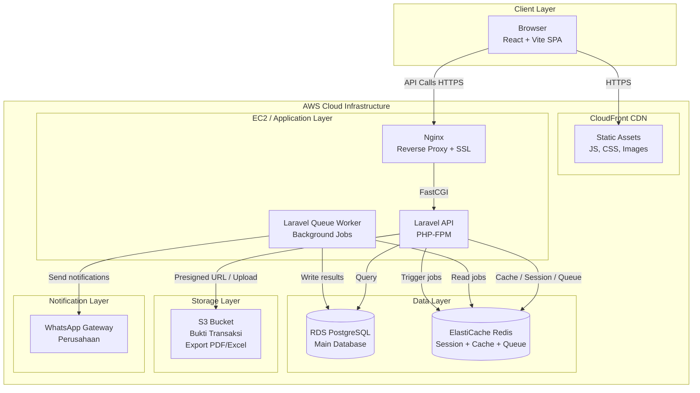

# Technical Architecture Document (TAD)
# Sistem Dana Operasional Kebun (PDO)
# PT Barumun Palma Nauli

---

| Atribut | Detail |
|---|---|
| Versi | 1.1 — Semua Open Decisions Dikonfirmasi |
| Tanggal | 18 Juni 2026 |
| Referensi PRD | v1.7 |
| Referensi BRD | v1.1 |
| Referensi ERD | v1.1 |
| Target Go-Live | **29 Juni 2026** |
| Tim | 2–3 developer fullstack + 1 QA |
| Hosting | AWS Cloud |

---

## Daftar Isi

1. System Overview
2. Backend Architecture
3. Frontend Architecture
4. Database Architecture
5. Security Architecture
6. Deployment Architecture
7. Development Standards
8. Implementation Roadmap
9. Open Technical Decisions

---

## 1. System Overview

### 1.1 Architecture Style

**Rekomendasi: Modular Monolith dalam Monorepo**

Untuk konteks proyek ini (tim 2–3 developer, go-live 29 Juni 2026 = ~11 hari dari sekarang, ~50–100 pengguna), **Modular Monolith** adalah pilihan yang paling rasional. Berikut perbandingannya:

| Kriteria | Monolith Modular | Microservices | Microservices Terpisah |
|---|---|---|---|
| Kecepatan development | ✅ Paling cepat | ⚠️ Lambat (boilerplate besar) | ❌ Sangat lambat |
| Jumlah developer ideal | 1–5 | 5–20 | 10+ |
| Kompleksitas operasional | ✅ Rendah | ⚠️ Tinggi | ❌ Sangat tinggi |
| Debugging & tracing | ✅ Mudah | ⚠️ Sulit | ❌ Sangat sulit |
| Skalabilitas | ✅ Cukup untuk 50–100 user | ✅ Horizontal scale | ✅ Unlimited |
| Cocok untuk timeline ketat | ✅ Ya | ❌ Tidak | ❌ Tidak |

**Struktur Monorepo:**
```
pdo-system/
├── apps/
│   ├── api/          ← Backend Laravel (PHP 8.3)
│   └── web/          ← Frontend React + Vite
├── packages/
│   └── shared-types/ ← TypeScript types bersama (opsional)
├── docs/
├── docker-compose.yml
└── .github/workflows/
```

Meskipun dibangun sebagai monolith, kode diorganisir secara modular (per domain: PDO, Realization, Transfer, MasterData, Auth) sehingga jika di masa depan perlu dipecah menjadi service terpisah, boundary-nya sudah jelas.

---

### 1.2 High-Level Architecture Diagram



---

### 1.3 Technology Stack

| Layer | Pilihan Utama | Alternatif | Justifikasi |
|---|---|---|---|
| **Frontend** | React 19 + Vite + TypeScript | Vue 3 + Nuxt | React 19 membawa React Compiler (optimasi re-render otomatis), `use()` hook untuk data fetching, dan Actions API — cocok untuk form PDO yang kompleks. Vite jauh lebih cepat dari CRA/Webpack. TypeScript wajib untuk sistem keuangan |
| **UI Components** | Shadcn/ui + Tailwind CSS | Ant Design, MUI | Shadcn/ui tidak locked ke satu vendor, komponen bisa dikustomisasi penuh. Tailwind memungkinkan desain konsisten tanpa CSS custom yang besar |
| **State Management** | TanStack Query (React Query) v5 | SWR, Zustand | React Query menangani server state (cache, refetch, invalidation) dengan sangat baik. Cocok untuk data fetching yang kompleks seperti PDO dengan banyak relasi |
| **Backend** | Laravel 13 (PHP 8.4) | Node.js/Express, Django | Laravel 13 adalah versi terbaru LTS dengan peningkatan performa signifikan, typed properties yang lebih baik, dan dukungan PHP 8.4. Ekosistem lengkap (Eloquent ORM, Queue, Events, Artisan). Tim lebih mudah menemukan developer PHP di Indonesia |
| **Database** | PostgreSQL 15 (AWS RDS) | MySQL | PostgreSQL unggul untuk data keuangan: NUMERIC type, JSONB untuk audit log, row-level locking, constraint yang lebih ketat. RDS managed mengurangi beban operasional |
| **Cache / Queue** | Redis 7 (AWS ElastiCache) | Database queue | Redis untuk tiga keperluan: session storage, queue backend (Laravel Horizon), dan cache query dashboard yang berat |
| **File Storage** | AWS S3 | MinIO self-hosted | S3 managed, highly durable (99.999999999%), tidak perlu maintenance. Biaya sangat terjangkau untuk volume file bukti transaksi |
| **Auth** | JWT (Laravel Sanctum) | Session cookie | JWT stateless cocok untuk SPA. Laravel Sanctum menyederhanakan implementasi token API. Token disimpan di HttpOnly cookie untuk keamanan XSS |
| **Notifikasi** | WhatsApp Gateway Perusahaan | — | Sudah tersedia. Tidak memerlukan email provider tambahan — notifikasi email tidak dibutuhkan (OPS-04) |
| **Hosting** | AWS EC2 (t3.medium) + RDS Single-AZ | — | Sesuai C-05 PRD v1.7. Single-AZ cukup untuk target 99% uptime hari kerja (OPS-05) — tidak perlu Multi-AZ |
| **CI/CD** | **GitHub Actions** | GitLab CI | Repository di GitHub (TEC-02). GitHub Actions gratis untuk repo private sampai batas tertentu, integrasi native, ekosistem action besar |
| **Monitoring** | AWS CloudWatch + Sentry | Datadog | CloudWatch untuk infrastruktur (CPU, memory, disk), Sentry untuk error tracking aplikasi |

---

## 2. Backend Architecture

### 2.1 Project Structure (Laravel 13)

```
apps/api/
├── app/
│   ├── Console/
│   │   └── Commands/
│   │       └── ClosePdoMonthlyCommand.php    ← Scheduled job: auto-close PDO
│   │
│   ├── Http/
│   │   ├── Controllers/
│   │   │   ├── Auth/
│   │   │   │   └── AuthController.php
│   │   │   ├── MasterData/
│   │   │   │   ├── ExpenseCategoryController.php
│   │   │   │   ├── ExpenseSubcategoryController.php
│   │   │   │   └── ExpenseItemController.php
│   │   │   ├── PDO/
│   │   │   │   ├── PdoHeaderController.php
│   │   │   │   ├── PdoDetailController.php
│   │   │   │   ├── PdoApprovalController.php
│   │   │   │   └── PdoCloseController.php
│   │   │   ├── PdoSupplementary/
│   │   │   │   ├── PdoSupplementaryController.php
│   │   │   │   └── PdoSupplementaryMergeController.php
│   │   │   ├── Transfer/
│   │   │   │   └── TransferEntryController.php
│   │   │   ├── Realization/
│   │   │   │   ├── RealizationEntryController.php
│   │   │   │   └── RealizationAttachmentController.php
│   │   │   ├── Dashboard/
│   │   │   │   └── DashboardController.php
│   │   │   ├── Reports/
│   │   │   │   └── ReportController.php
│   │   │   ├── Settings/
│   │   │   │   └── SystemSettingController.php
│   │   │   └── Users/
│   │   │       └── UserController.php
│   │   │
│   │   ├── Middleware/
│   │   │   ├── EnsureUnitAccess.php          ← Row-level security: unit kebun
│   │   │   ├── CheckPdoOwnership.php          ← Self-approval prevention
│   │   │   └── CheckPdoStatus.php             ← PDO status guard
│   │   │
│   │   └── Requests/                          ← Form Request Validation
│   │       ├── PDO/
│   │       │   ├── CreatePdoRequest.php
│   │       │   ├── SubmitPdoRequest.php
│   │       │   └── ApprovePdoRequest.php
│   │       └── Realization/
│   │           └── CreateRealizationRequest.php
│   │
│   ├── Models/
│   │   ├── PdoHeader.php
│   │   ├── PdoDetail.php
│   │   ├── PdoApprovalLog.php
│   │   ├── PdoSupplementaryHeader.php
│   │   ├── TransferEntry.php
│   │   ├── RealizationEntry.php
│   │   ├── RealizationAttachment.php
│   │   ├── ExpenseCategory.php
│   │   ├── ExpenseSubcategory.php
│   │   ├── ExpenseItem.php
│   │   ├── User.php
│   │   ├── Role.php
│   │   ├── SystemSetting.php
│   │   └── AuditLog.php
│   │
│   ├── Services/                              ← Business Logic Layer
│   │   ├── PDO/
│   │   │   ├── PdoCreationService.php         ← Buat PDO + template otomatis
│   │   │   ├── PdoApprovalService.php         ← State machine approval
│   │   │   ├── PdoMergeService.php            ← Merger PDO Tambahan → Bulanan
│   │   │   └── PdoCloseService.php            ← Auto-close dan manual-close
│   │   ├── Realization/
│   │   │   ├── RealizationService.php         ← Validasi kumulatif PDO
│   │   │   └── FileUploadService.php          ← Upload ke S3
│   │   ├── Transfer/
│   │   │   └── TransferService.php
│   │   ├── Notification/
│   │   │   └── WhatsAppNotificationService.php
│   │   ├── Report/
│   │   │   └── ReportExportService.php
│   │   └── Audit/
│   │       └── AuditLogService.php
│   │
│   ├── Events/                                ← Domain Events
│   │   ├── PdoSubmitted.php
│   │   ├── PdoApproved.php
│   │   ├── PdoRejected.php
│   │   ├── PdoFinalized.php
│   │   └── PdoClosed.php
│   │
│   ├── Listeners/                             ← Event Handlers
│   │   ├── SendApprovalNotification.php
│   │   ├── SendRejectionNotification.php
│   │   └── RecordAuditLog.php
│   │
│   └── Jobs/                                  ← Queue Jobs (async)
│       ├── ExportReportJob.php
│       ├── SendWhatsAppJob.php
│       └── AutoClosePdoJob.php
│
├── database/
│   ├── migrations/                            ← Terurut by timestamp
│   └── seeders/
│       ├── RoleSeeder.php
│       ├── SystemSettingSeeder.php
│       └── NotificationTemplateSeeder.php
│
├── routes/
│   └── api.php                                ← Semua route /api/v1/
│
├── config/
│   ├── pdo.php                                ← Konfigurasi domain spesifik
│   └── filesystems.php                        ← S3 configuration
│
└── tests/
    ├── Unit/
    │   ├── Services/
    │   │   ├── PdoApprovalServiceTest.php
    │   │   └── RealizationServiceTest.php
    │   └── Models/
    └── Feature/
        ├── PDO/
        │   ├── CreatePdoTest.php
        │   ├── ApprovalWorkflowTest.php
        │   └── SubmitPdoTest.php
        └── Realization/
            └── CreateRealizationTest.php
```

**Prinsip Separation of Concerns:**

- **Controller**: Hanya menerima request, memanggil Service, mengembalikan response. Tidak ada business logic di sini.
- **Service**: Semua business logic ada di sini. Service dapat memanggil Repository/Model dan Service lain. Service juga men-dispatch Event.
- **Model/Eloquent**: Data mapping dan relasi antar tabel. Query sederhana ada di sini, query kompleks di Repository atau Service.
- **Form Request**: Validasi input HTTP (required, format, tipe data). Business rule validation ada di Service.
- **Event + Listener**: Decoupling side effects (notifikasi, audit log) dari business logic utama.

---

### 2.2 Authentication & Authorization

**Mekanisme: JWT via Laravel Sanctum (HttpOnly Cookie)**

Alasan memilih JWT disimpan di HttpOnly Cookie daripada localStorage:
- **XSS Protection**: Token tidak bisa diakses JavaScript jika disimpan di HttpOnly cookie
- **SPA friendly**: Cookie dikirim otomatis di setiap request ke same origin
- **Stateless-capable**: JWT bisa divalidasi tanpa database lookup untuk setiap request
- **Revocable**: Sanctum menyimpan token hash di database, sehingga bisa di-revoke saat logout

```
Request Flow:
Browser → Nginx → Laravel
    │
    ├── AuthMiddleware: Validasi JWT dari HttpOnly cookie
    │       └── Ekstrak user + role dari token payload
    │
    ├── UnitAccessMiddleware: Cek apakah user boleh akses unit ini
    │       └── KERANI/ASISTEN: hanya unit sendiri
    │       └── Role lain: semua unit
    │
    └── PermissionMiddleware: Cek permission spesifik
            └── Contoh: 'pdo:approve' hanya untuk ASISTEN, MANAJER, DIREKTUR
```

**Permission Matrix:**

```php
// config/permissions.php
return [
    'pdo' => [
        'create'            => ['KERANI'],
        'read'              => ['*'],  // semua role
        'update'            => ['KERANI'],  // hanya Draft
        'delete'            => ['KERANI'],  // hanya Draft
        'submit'            => ['KERANI'],
        'approve'           => ['ASISTEN_KEBUN', 'MANAJER_KEBUN', 'MANAJER_KEUANGAN', 'DIREKTUR_KEUANGAN'],
        'reject'            => ['ASISTEN_KEBUN', 'MANAJER_KEBUN', 'MANAJER_KEUANGAN', 'DIREKTUR_KEUANGAN'],
        'close'             => ['MANAJER_KEUANGAN'],
    ],
    'transfer' => [
        'create'            => ['MANAJER_KEUANGAN', 'STAFF_KEUANGAN'],
        'update'            => ['MANAJER_KEUANGAN', 'STAFF_KEUANGAN'],
        'read'              => ['*'],
    ],
    'realization' => [
        'create'            => ['KERANI', 'STAFF_PURCHASING'],
        'update'            => ['KERANI'],
        'delete'            => ['KERANI'],
        'read'              => ['*'],
    ],
    'master' => [
        'manage'            => ['ADMIN'],
        'read'              => ['*'],
    ],
    'user' => [
        'manage'            => ['ADMIN'],
    ],
    'settings' => [
        'manage'            => ['ADMIN'],
    ],
    'reports' => [
        'export'            => ['*'],
    ],
];
```

**Catatan khusus Staff Purchasing**: Pembatasan `funding_source = rekening_utama` divalidasi di `RealizationService`, bukan di permission layer, karena ini adalah validasi data (bukan akses resource).

---

### 2.3 Approval Workflow Engine

Approval PDO diimplementasikan sebagai **explicit state machine** tanpa library eksternal — cukup sederhana untuk diimplementasikan manual dan lebih mudah di-debug.

**State Transitions:**

```
draft
  → submitted        (trigger: KERANI submit)
  → reviewed_asisten (trigger: ASISTEN approve)
  → in_review_manager (trigger: sistem, setelah reviewed_asisten)
  → in_review_direktur (trigger: sistem, setelah kedua manajer approve)
  → final            (trigger: DIREKTUR approve)
  → closed           (trigger: sistem auto / MANAJER_KEUANGAN manual)

Dari status manapun (kecuali final/closed):
  → draft            (trigger: reject oleh approver yang berwenang)
```

**Pseudocode `PdoApprovalService::approveOrReject()`:**

```php
function approveOrReject(string $pdoId, User $actor, string $action, ?string $notes): PdoHeader
{
    // 1. Load PDO dengan lock untuk mencegah race condition
    $pdo = PdoHeader::lockForUpdate()->findOrFail($pdoId);

    // 2. Self-approval check
    if ($pdo->created_by === $actor->id) {
        throw new SelfApprovalException();
    }

    // 3. Validasi tahap approval sesuai status PDO dan role actor
    $this->validateApprovalStage($pdo->status, $actor->role->code);

    // 4. Hitung sequence_number berikutnya
    $nextSeq = PdoApprovalLog::where('pdo_header_id', $pdoId)->max('sequence_number') + 1;

    DB::transaction(function () use ($pdo, $actor, $action, $notes, $nextSeq) {

        if ($action === 'reject') {
            // Reject: kembali ke draft, hapus semua approval pending di tahap manajer
            $pdo->update(['status' => 'draft']);
            PdoApprovalLog::create([
                'pdo_header_id'  => $pdo->id,
                'actor_user_id'  => $actor->id,
                'approval_stage' => $this->currentStage($pdo->status),
                'action'         => 'reject',
                'reason'         => $notes,
                'sequence_number'=> $nextSeq,
            ]);

        } elseif ($action === 'approve') {
            $newStatus = $this->resolveNextStatus($pdo, $actor);
            // resolveNextStatus: jika tahap manajer dan salah satu belum approve,
            // kembalikan status yang sama (in_review_manager) sampai keduanya approve

            $pdo->update(['status' => $newStatus]);
            PdoApprovalLog::create([
                'pdo_header_id'  => $pdo->id,
                'actor_user_id'  => $actor->id,
                'approval_stage' => $this->currentStage($pdo->status),
                'action'         => 'approve',
                'reason'         => $notes,
                'sequence_number'=> $nextSeq,
            ]);

            // Jika status berubah ke final, dispatch event
            if ($newStatus === 'final') {
                event(new PdoFinalized($pdo));
            }
        }
    });

    return $pdo->fresh();
}

private function resolveNextStatus(PdoHeader $pdo, User $actor): string
{
    match ($pdo->status) {
        'submitted'          => 'reviewed_asisten',
        'reviewed_asisten'   => 'in_review_manager',
        'in_review_manager'  => $this->resolveManagerStage($pdo, $actor),
        'in_review_direktur' => 'final',
        default              => throw new InvalidApprovalStageException(),
    };
}

private function resolveManagerStage(PdoHeader $pdo, User $actor): string
{
    // Cek apakah Manajer yang LAIN sudah approve di putaran ini
    $otherManagerRole = ($actor->role->code === 'MANAJER_KEBUN')
        ? 'MANAJER_KEUANGAN' : 'MANAJER_KEBUN';

    // Cari approval manajer lain setelah resubmit terakhir
    $lastResubmitSeq = PdoApprovalLog::where('pdo_header_id', $pdo->id)
        ->where('action', 'resubmit')
        ->max('sequence_number') ?? 0;

    $otherApproved = PdoApprovalLog::where('pdo_header_id', $pdo->id)
        ->where('sequence_number', '>', $lastResubmitSeq)
        ->whereHas('actor', fn($q) => $q->whereHas('role', fn($r) => $r->where('code', $otherManagerRole)))
        ->where('action', 'approve')
        ->exists();

    return $otherApproved ? 'in_review_direktur' : 'in_review_manager';
}
```

**Concurrent Approval Handling:**
`lockForUpdate()` pada `PdoHeader` memastikan dua Manajer yang approve bersamaan tidak menyebabkan race condition. Satu transaksi akan menunggu yang lain selesai.

---

### 2.4 Kalkulasi Finansial

**Aturan kalkulasi yang berlaku (sesuai PRD v1.7, CL-08):**

```
Jumlah per baris = nilai yang diinput Kerani (satu kolom, tidak ada Remisi I/II)
Grand Total PDO  = SUM(amount) semua pdo_details
Total Transfer   = SUM(amount) semua transfer_entries untuk PDO ini
Total Realisasi  = SUM(amount) semua realization_entries untuk PDO ini
Saldo PDO        = Total Transfer - Total Realisasi
Progress %       = (Total Realisasi / Total Transfer) × 100
```

**Tipe data: BIGINT (Rupiah bulat), bukan FLOAT/DECIMAL**

Semua nilai moneter disimpan sebagai `BIGINT` dalam satuan Rupiah (bilangan bulat). Ini menghindari floating-point precision error sepenuhnya.

Justifikasi:
- Rupiah tidak memiliki desimal (tidak seperti USD yang punya sen)
- `BIGINT` (8 bytes) mendukung nilai hingga ±9.2 × 10¹⁸ — jauh lebih dari cukup
- Kalkulasi integer di PostgreSQL selalu tepat, tidak ada rounding error
- Lebih sederhana dari `NUMERIC(20,0)` untuk kasus ini

**Kalkulasi selalu di server:**

```php
// RealizationService.php
public function checkCumulativeLimit(string $pdoHeaderId, int $newAmount): void
{
    // Query agregat langsung ke database — tidak menggunakan cached values
    $totalTransfer = DB::table('transfer_entries')
        ->join('pdo_details', 'transfer_entries.pdo_detail_id', '=', 'pdo_details.id')
        ->where('pdo_details.pdo_header_id', $pdoHeaderId)
        ->sum('transfer_entries.amount');

    $totalRealization = DB::table('realization_entries')
        ->join('pdo_details', 'realization_entries.pdo_detail_id', '=', 'pdo_details.id')
        ->where('pdo_details.pdo_header_id', $pdoHeaderId)
        ->sum('realization_entries.amount');

    if (($totalRealization + $newAmount) > $totalTransfer) {
        $remaining = $totalTransfer - $totalRealization;
        throw new RealizationLimitExceededException($totalTransfer, $remaining);
    }
}
```

Frontend boleh menampilkan kalkulasi real-time sebagai UX preview, namun validasi final selalu dari server.

---

### 2.5 File Upload (Bukti Transaksi)

**Strategy: Backend-proxied upload ke S3**

Flow upload:
```
1. Frontend kirim file ke POST /api/v1/realization-entries/{id}/attachments
2. Backend validasi: MIME type, ukuran (≤5MB)
3. Backend upload ke S3 menggunakan AWS SDK
4. Backend simpan path S3 ke realization_attachments.file_path
5. Backend generate presigned URL (1 jam) dan kembalikan ke frontend
```

Alternatif (direct upload dari browser ke S3) tidak dipilih karena:
- Memerlukan AWS credentials di frontend (risiko keamanan)
- Validasi file (MIME, ukuran) lebih sulit diterapkan sebelum upload
- Flow lebih kompleks untuk tim kecil

**Validasi file di backend:**
```php
// CreateAttachmentRequest.php
public function rules(): array
{
    return [
        'file' => [
            'required',
            'file',
            'max:5120',          // 5 MB dalam KB
            'mimes:pdf,jpg,jpeg,png',
        ],
    ];
}
```

**Naming convention di S3:**
```
s3://pdo-barumunpalma-prod/
  attachments/
    {pdo_header_id}/
      {pdo_detail_id}/
        {realization_entry_id}/
          {uuid}-{original_filename_sanitized}.{ext}
```

**Akses file: Presigned URL (1 jam)**
- File di S3 bersifat private (tidak public)
- Setiap request preview/download menghasilkan presigned URL baru via `Storage::temporaryUrl()`
- Presigned URL dikirim di response API, bukan disimpan di database

**Virus scanning:** Tidak diimplementasikan di versi 1.0 (kompleksitas tinggi, tim kecil). Mitigasi: validasi MIME type ketat + S3 bucket policy yang tidak mengizinkan eksekusi file.

---

### 2.6 Background Jobs / Queue

**Queue backend: Redis (AWS ElastiCache) + Laravel Horizon**

Proses yang berjalan secara asinkron:

| Job | Trigger | Estimasi Durasi | Queue |
|---|---|---|---|
| `SendWhatsAppJob` | Setiap transisi status PDO | < 2 detik | `notifications` (high priority) |
| `ExportReportJob` | `POST /api/v1/reports/export` | 5–30 detik | `exports` (normal priority) |
| `AutoClosePdoJob` | Scheduled daily 23:55 WIB | < 5 detik | `scheduled` |

**Laravel Horizon** digunakan untuk monitoring dan manajemen queue (dashboard web, retry failed jobs, metrics).

**Scheduled Commands (Laravel Scheduler):**
```php
// app/Console/Kernel.php
$schedule->command('pdo:auto-close')
         ->dailyAt('23:55')
         ->timezone('Asia/Jakarta')
         ->onOneServer();  // Tidak duplicate jika multi-server

$schedule->command('pdo:send-monthly-reminder')
         ->monthlyOn(1, '08:00')  // Tanggal 1 jam 08:00 WIB (default, bisa dikonfigurasi)
         ->timezone('Asia/Jakarta')
         ->onOneServer();
```

---

### 2.7 Audit Trail

**Disimpan di tabel `audit_logs` di database** (bukan file log) — sudah didefinisikan di ERD v1.1.

Keputusan menyimpan di database (bukan file):
- Dapat di-query dan difilter per entity, per user, per periode
- Tidak hilang saat instance restart
- Dapat ditampilkan di UI (history per item, history per user)
- Volume kecil (ratusan PDO/tahun = ribuan log entries — tidak ada issue performa)

**Event yang harus di-log (sesuai BRD v1.1, BR-NOTIF-005):**

```php
// AuditLogService.php
public function log(
    ?User $actor,          // null untuk aksi sistem (auto-close)
    string $entityType,    // 'pdo_headers', 'transfer_entries', dll.
    string $entityId,      // UUID entity yang berubah
    string $action,        // 'INSERT', 'UPDATE', 'STATUS_CHANGE', 'CLOSE'
    ?array $oldValues,     // null untuk INSERT
    ?array $newValues,     // null untuk DELETE
): void {
    AuditLog::create([
        'actor_user_id' => $actor?->id,
        'entity_type'   => $entityType,
        'entity_id'     => $entityId,
        'action'        => $action,
        'old_values'    => $oldValues ? json_encode($oldValues) : null,
        'new_values'    => $newValues ? json_encode($newValues) : null,
        'ip_address'    => request()->ip(),
        'user_agent'    => request()->userAgent(),
    ]);
}
```

**Audit log bersifat append-only** — tidak ada endpoint DELETE/UPDATE untuk `audit_logs`. Di level database, tabel ini dapat diberi policy khusus di PostgreSQL.

**Retention:** Data audit disimpan selamanya (tidak ada penghapusan otomatis). Volume sangat kecil sehingga tidak ada kebutuhan archiving dalam jangka pendek.

---

## 3. Frontend Architecture

### 3.1 Technology Choice

**React 19 + Vite + TypeScript**

Justifikasi:
- **React 19**: Versi terbaru dengan React Compiler yang mengoptimasi re-render secara otomatis (tidak perlu `useMemo`/`useCallback` berlebihan), `use()` hook untuk data fetching lebih ergonomis, dan Actions API untuk form handling — sangat membantu untuk form PDO yang kompleks dengan banyak state.
- **Vite**: Build tool modern, HMR (Hot Module Replacement) sangat cepat — penting untuk developer experience dengan deadline ketat.
- **TypeScript**: Wajib untuk sistem keuangan. Menangkap kesalahan tipe (nominal tertukar, field yang salah) di compile time. Dengan API Spec yang sudah detail, TypeScript interfaces bisa di-generate otomatis dari OpenAPI spec.

**Catatan kompatibilitas React 19**: TanStack Query v5 dan Shadcn/ui sudah kompatibel penuh dengan React 19. Pastikan semua library third-party dicek kompatibilitasnya sebelum install.

**Library pendukung:**
- **React Router v6**: Client-side routing
- **TanStack Query v5**: Server state management (cache, refetch, invalidation)
- **React Hook Form + Zod**: Form management + validasi schema
- **Shadcn/ui + Radix UI**: Komponen accessible (dialog, dropdown, toast)
- **Tailwind CSS v3**: Utility-first styling
- **Recharts**: Grafik dashboard (bar chart, donut chart)
- **date-fns**: Manipulasi tanggal (format periode PDO)
- **axios**: HTTP client dengan interceptor untuk token handling

---

### 3.2 State Management

**Prinsip: Server state di TanStack Query, UI state di React state/Zustand**

| State | Tool | Contoh |
|---|---|---|
| Server data (PDO, master data, dashboard) | TanStack Query | `useQuery(['pdo', id], fetchPdo)` |
| Form state (isian PDO baris per baris) | React Hook Form | `useForm({ defaultValues: templateItems })` |
| UI state global (sidebar, notifications) | Zustand | `useUIStore` |
| Local UI state (expand/collapse, selected tab) | `useState` | Per komponen |

**Cascading Dropdown (Kategori → Sub-Kategori → Item):**
```typescript
// Saat Kategori dipilih, invalidate dan refetch Sub-Kategori
const { data: subcategories } = useQuery({
  queryKey: ['subcategories', selectedCategoryId],
  queryFn: () => fetchSubcategories(selectedCategoryId),
  enabled: !!selectedCategoryId,  // Hanya fetch jika kategori sudah dipilih
});

// Saat Sub-Kategori berubah, reset Item yang dipilih
useEffect(() => {
  setValue('expense_item_id', null);
}, [selectedSubcategoryId]);
```

**Kalkulasi Grand Total real-time:**
```typescript
// Gunakan useWatch untuk reactive updates tanpa re-render seluruh form
const details = useWatch({ control, name: 'details' });
const grandTotal = useMemo(
  () => details.reduce((sum, row) => sum + (row.amount || 0), 0),
  [details]
);
```

---

### 3.3 Key Component Architecture

**A. Editable PDO Table**

```
<PdoEditableTable>
  ├── <PdoTableHeader />                  ← Heading kolom
  ├── <PdoTableBody>
  │     └── <PdoTableRow key={field.id}> ← Per baris (react-hook-form useFieldArray)
  │           ├── <CategoryDropdown />    ← Pilih Kategori
  │           ├── <SubcategoryDropdown /> ← Reactive ke Kategori
  │           ├── <ItemDropdown />        ← Reactive ke Sub-Kategori, autofill setelah pilih
  │           ├── <AccountNumberField />  ← Autofilled, editable
  │           ├── <DescriptionField />    ← Wajib diisi
  │           ├── <QtyField />            ← Opsional
  │           ├── <UnitField />           ← Autofilled, editable
  │           ├── <RateField />           ← Autofilled, editable
  │           ├── <AmountField />         ← Input utama (atau tombol "Ambil Biaya" jika auto_external)
  │           ├── <FetchExternalButton /> ← Tampil hanya jika mode_input = auto_external
  │           └── <RowActions />          ← Tombol Duplikasi + Hapus
  └── <PdoTableFooter>
        └── Grand Total (useMemo dari semua amount)
```

**Validasi baris (invalid row highlighting):**
```typescript
const isRowInvalid = (row: PdoDetailFormData): boolean => {
  if (row.expense_item?.mode_input === 'auto_external' && row.amount === 0) return true;
  if (!row.description?.trim()) return true;
  if (row.amount <= 0) return true;
  return false;
};

// Di komponen row:
<tr className={isRowInvalid(row) ? 'bg-red-50 border-red-200' : ''}>
```

**B. Hierarchical Detail Table (halaman Detail PDO)**

```
<HierarchicalTable data={groupedByCategory}>
  ├── <CategoryRow category="A - Gaji Staff" expanded={true}>  ← Toggle expand
  │     ├── <SubcategoryRow subcategory="A1 - Staff Kebun">
  │     │     ├── <ItemRow item={gajiManager} onClick={openDrawer} />
  │     │     └── <ItemRow item={gajiAsisten} onClick={openDrawer} />
  │     └── <SubcategoryRow subcategory="A2 - Pegawai Kantor">
  │           └── <ItemRow item={gajiKrani} onClick={openDrawer} />
  └── <CategoryRow category="E - Divisi Traksi" expanded={false} />

<ItemDetailDrawer
  isOpen={drawerOpen}
  item={selectedItem}
  onClose={() => setDrawerOpen(false)}
/>
```

Data di-group di frontend sebelum render:
```typescript
const groupedData = useMemo(() => groupByCategory(pdoDetails), [pdoDetails]);
```

---

### 3.4 Form Validation Strategy

**Dua lapis validasi:**

1. **Client-side (React Hook Form + Zod)** — UX, cepat, tanpa network:
   - Field required (description, amount > 0)
   - Tipe data (number, date format)
   - Nilai negatif (amount >= 0)
   - Ditampilkan inline di bawah field

2. **Server-side (Laravel Form Request)** — kebenaran bisnis:
   - Business rules (PDO_ALREADY_EXISTS, SELF_APPROVAL_NOT_ALLOWED, dll.)
   - Ditampilkan via toast notification + field error dari response

```typescript
// Tampilkan server errors di form fields
const onSubmit = async (data: CreatePdoForm) => {
  try {
    await createPdo.mutateAsync(data);
    toast.success('PDO berhasil dibuat');
    navigate('/pdo');
  } catch (error) {
    if (isApiValidationError(error)) {
      // Map server field errors ke react-hook-form
      error.details.forEach(({ field, message }) => {
        setError(field as keyof CreatePdoForm, { message });
      });
    } else {
      toast.error(error.message);
    }
  }
};
```

---

### 3.5 API Integration Pattern

**HTTP Client: Axios dengan interceptor**

```typescript
// lib/api.ts
const api = axios.create({
  baseURL: import.meta.env.VITE_API_URL,
  withCredentials: true,  // Kirim HttpOnly cookie otomatis
});

// Interceptor: handle 401 (token expired) → redirect ke login
api.interceptors.response.use(
  (response) => response,
  async (error) => {
    if (error.response?.status === 401) {
      // Coba refresh token sekali
      try {
        await api.post('/auth/refresh-token');
        return api(error.config);  // Retry request original
      } catch {
        window.location.href = '/login';
      }
    }
    return Promise.reject(error);
  }
);
```

**TanStack Query patterns:**

```typescript
// Query: ambil detail PDO (auto-refetch setiap 30 detik untuk status update)
const { data: pdo, isLoading } = useQuery({
  queryKey: ['pdo', id],
  queryFn: () => api.get(`/pdo/${id}`).then(r => r.data.data),
  refetchInterval: 30_000,  // Polling status approval
  staleTime: 10_000,
});

// Mutation: submit PDO
const submitPdo = useMutation({
  mutationFn: (id: string) => api.post(`/pdo/${id}/submit`),
  onSuccess: () => {
    queryClient.invalidateQueries({ queryKey: ['pdo', id] });
    queryClient.invalidateQueries({ queryKey: ['pdo'] });
    toast.success('PDO berhasil disubmit');
  },
});

// Optimistic update untuk input realisasi (UX lebih responsif)
const saveRealization = useMutation({
  mutationFn: createRealizationEntry,
  onMutate: async (newEntry) => {
    await queryClient.cancelQueries({ queryKey: ['pdo-realizations', pdoId] });
    const prev = queryClient.getQueryData(['pdo-realizations', pdoId]);
    queryClient.setQueryData(['pdo-realizations', pdoId], (old) =>
      optimisticAdd(old, newEntry)
    );
    return { prev };
  },
  onError: (err, _, context) => {
    queryClient.setQueryData(['pdo-realizations', pdoId], context?.prev);
    toast.error(err.message);
  },
  onSettled: () => {
    queryClient.invalidateQueries({ queryKey: ['pdo-realizations', pdoId] });
  },
});
```

---

## 4. Database Architecture

### 4.1 Database Selection

**PostgreSQL 15 di AWS RDS**

Alasan memilih PostgreSQL untuk sistem keuangan:

1. **Integritas data**: PostgreSQL memiliki constraint yang lebih ketat daripada MySQL — foreign key constraint, check constraint, dan exclusion constraint sangat penting untuk sistem keuangan
2. **JSONB**: Digunakan untuk menyimpan `old_values`/`new_values` di `audit_logs` — query JSONB di PostgreSQL sangat efisien
3. **Transaksi ACID**: Full ACID compliance dengan isolasi yang bisa dikonfigurasi per transaksi (dibutuhkan untuk concurrent approval oleh dua manajer)
4. **`BIGINT` arithmetic**: Kalkulasi integer untuk Rupiah selalu exact — tidak ada floating-point issue
5. **Row-level locking**: `SELECT ... FOR UPDATE` untuk mencegah race condition pada concurrent approval
6. **AWS RDS managed**: Automated backup, failover, monitoring — mengurangi beban operasional tim kecil

---

### 4.2 Connection Pooling

**Konfigurasi untuk 50–100 user concurrent:**

```ini
# config/database.php (Laravel)
'pgsql' => [
    'pool' => [
        'min'  => 5,
        'max'  => 20,   # EC2 t3.medium + RDS db.t3.medium bisa handle 20 koneksi
    ],
]
```

**Kalkulasi:** 100 user × rata-rata 0.1 koneksi aktif = ~10 koneksi. Max 20 koneksi memberikan headroom yang cukup. RDS db.t3.medium mendukung hingga ~170 koneksi PostgreSQL.

Untuk produksi, pertimbangkan **PgBouncer** di depan RDS jika koneksi menjadi bottleneck (biasanya tidak diperlukan untuk skala ini).

---

### 4.3 Migration Strategy

**Tool: Laravel built-in migrations**

Sudah terintegrasi sempurna dengan Eloquent, tidak perlu dependency tambahan (Flyway/Liquibase).

**Naming convention:**
```
YYYY_MM_DD_HHMMSS_create_{table_name}_table.php
YYYY_MM_DD_HHMMSS_add_{column}_to_{table}_table.php
YYYY_MM_DD_HHMMSS_modify_{column}_in_{table}_table.php
```

**Rollback strategy:**
- Setiap migration wajib memiliki method `down()` yang benar
- Sebelum deploy production: test `php artisan migrate:rollback` di staging
- Untuk perubahan destruktif (drop column): tambahkan column baru dulu, migrate data, baru drop column lama (blue-green migration)
- Jangan pernah rollback di production tanpa backup terbaru

---

### 4.4 Indexing Strategy

Semua index sudah didefinisikan lengkap di **ERD v1.1 Bagian 4** (45 index untuk 18 tabel). Berikut index paling kritis yang harus diprioritaskan:

```sql
-- Query paling sering: validasi kumulatif setiap input realisasi
-- Dieksekusi setiap POST /realization-entries
CREATE INDEX idx_realization_entries_pdo_detail_date
    ON realization_entries(pdo_detail_id, transaction_date ASC);

-- Agregasi dashboard per unit + periode
CREATE INDEX idx_pdo_headers_unit_period
    ON pdo_headers(plantation_unit_id, period_year DESC, period_month DESC);

-- Self-approval check saat approve
CREATE INDEX idx_pdo_headers_created_by ON pdo_headers(created_by);

-- Approval timeline per PDO (kronologis)
CREATE INDEX idx_pdo_approval_logs_pdo_sequence
    ON pdo_approval_logs(pdo_header_id, sequence_number ASC);
```

---

### 4.5 Backup & Recovery

**AWS RDS Automated Backup:**

| Parameter | Nilai | Keterangan |
|---|---|---|
| Backup window | 01:00–02:00 WIB | Di luar jam kerja |
| Retention period | 7 hari | Bisa restore ke titik manapun dalam 7 hari |
| RPO (Recovery Point Objective) | ≤ 5 menit | RDS Point-in-Time Recovery |
| RTO (Recovery Time Objective) | ≤ 30 menit | Restore RDS snapshot |

**Tambahan: Manual snapshot sebelum setiap deploy production** — dilakukan via AWS Console atau CLI sebelum `php artisan migrate`.

**S3 Versioning:** Aktifkan S3 versioning pada bucket `pdo-barumunpalma-prod` untuk melindungi file bukti dari penghapusan tidak sengaja.

---

## 5. Security Architecture

### 5.1 Authentication Security

```php
// Password hashing: bcrypt dengan cost factor 12
Hash::make($password, ['rounds' => 12]);

// Token: Laravel Sanctum, disimpan di HttpOnly cookie
// Expire: 1 jam (access token), 7 hari (refresh token, rotated)

// Rate limiting login: 5 percobaan per IP per 15 menit
RateLimiter::for('login', function (Request $request) {
    return Limit::perMinutes(15, 5)->by($request->ip());
});

// CSRF: Dihandle otomatis oleh Laravel Sanctum untuk SPA
// (menggunakan cookie CSRF token + header X-XSRF-TOKEN)
```

---

### 5.2 Authorization — Row-Level Security

```php
// EnsureUnitAccess.php Middleware
public function handle(Request $request, Closure $next): Response
{
    $user = $request->user();

    // Role lintas unit: tidak perlu filter
    if (in_array($user->role->code, [
        'ADMIN', 'MANAJER_KEBUN', 'MANAJER_KEUANGAN',
        'STAFF_KEUANGAN', 'DIREKTUR_KEUANGAN', 'STAFF_PURCHASING'
    ])) {
        return $next($request);
    }

    // Kerani & Asisten: tambahkan filter unit ke query scope
    // Menggunakan Global Scope Eloquent
    app()->bind('current_unit_id', fn() => $user->plantation_unit_id);

    return $next($request);
}
```

```php
// PdoHeader.php Model — Global Scope
protected static function booted(): void
{
    static::addGlobalScope('unit_access', function (Builder $builder) {
        if (app()->bound('current_unit_id')) {
            $builder->where('plantation_unit_id', app('current_unit_id'));
        }
    });
}
```

---

### 5.3 Input Validation & Sanitization

- **SQL Injection**: Eloquent ORM menggunakan parameterized queries — tidak ada raw SQL dengan input user tanpa binding
- **XSS**: Laravel Blade escaping otomatis. Di API response, data di-encode sebagai JSON (XSS tidak relevan untuk pure JSON API)
- **File upload**: MIME type divalidasi di level PHP (`finfo_file()`), bukan hanya dari ekstensi. Ukuran divalidasi sebelum menerima file
- **Mass assignment**: Semua Model menggunakan `$fillable` (whitelist), bukan `$guarded`
- **Nominal negatif**: CHECK constraint di database + validasi di Form Request: `'amount' => 'required|integer|min:1'`

---

### 5.4 Data Protection

**Data sensitif yang harus dilindungi:**
- Nominal PDO dan gaji karyawan
- API Key WhatsApp gateway (disimpan terenkripsi di `system_settings`)
- Password user

**Enkripsi API Key:**
```php
// Saat simpan setting wa_gateway_api_key:
SystemSetting::updateOrCreate(
    ['key' => 'wa_gateway_api_key'],
    ['value' => encrypt($apiKey)]  // Laravel encrypt (AES-256-CBC)
);

// Saat baca:
$apiKey = decrypt($setting->value);
```

**HTTPS**: Nginx dikonfigurasi untuk redirect semua HTTP ke HTTPS. SSL certificate dikelola via AWS Certificate Manager (ACM) — auto-renewal.

**Data di-rest**: RDS mendukung enkripsi at-rest via AWS KMS — aktifkan saat provisioning. S3 bucket dikonfigurasi dengan SSE-S3 (server-side encryption).

---

### 5.5 Logging & Monitoring

**Application Error Tracking: Sentry**
```php
// Sentry menangkap semua unhandled exception
// Alert dikirim ke email tim developer
SENTRY_LARAVEL_DSN=https://xxx@sentry.io/xxx
```

**Infrastructure Monitoring: AWS CloudWatch**
- CPU utilization EC2 > 80% → alert
- RDS connections > 80% max → alert
- S3 error rate > 1% → alert

**Security Logging:**
```php
// Dicatat di audit_logs (sudah ada di desain):
// - Login berhasil: action = 'LOGIN'
// - Login gagal: action = 'LOGIN_FAILED' (IP, email yang dicoba)
// - Logout: action = 'LOGOUT'
// - Perubahan password: action = 'PASSWORD_CHANGED'
```

**Alerting untuk anomali:**
- Login gagal > 5x dalam 15 menit dari satu IP → rate limit aktif (sudah di `AuthController`)
- CloudWatch alarm untuk unusual EC2 CPU spike

---

## 6. Deployment Architecture

### 6.1 Environment Strategy

| Environment | Tujuan | Infrastructure |
|---|---|---|
| **Local** | Development harian developer | Docker Compose (PHP, PostgreSQL, Redis) |
| **Staging** | QA testing, UAT, pre-deploy validation | EC2 t3.small + RDS db.t3.micro + ElastiCache |
| **Production** | Pengguna aktif | EC2 t3.medium + RDS db.t3.medium + ElastiCache |

**Docker Compose untuk local development:**
```yaml
# docker-compose.yml
services:
  api:
    build: ./apps/api
    ports: ["8000:8000"]
    environment:
      DB_HOST: db
      REDIS_HOST: redis
    depends_on: [db, redis]

  web:
    build: ./apps/web
    ports: ["5173:5173"]
    environment:
      VITE_API_URL: http://localhost:8000/api/v1

  db:
    image: postgres:15-alpine
    environment:
      POSTGRES_DB: pdo_local
      POSTGRES_PASSWORD: secret

  redis:
    image: redis:7-alpine
```

---

### 6.2 Infrastructure Recommendation

**Keputusan sudah final (C-05 PRD v1.7): AWS Cloud**

Perbandingan untuk konteks ini:

| | On-Premise | AWS EC2 + RDS | PaaS (Railway/Render) |
|---|---|---|---|
| Kontrol infrastruktur | ✅ Penuh | ✅ Penuh | ⚠️ Terbatas |
| Biaya initial | ❌ Tinggi (hardware) | ✅ Pay as you go | ✅ Sangat murah |
| Maintenance burden | ❌ Tinggi | ⚠️ Medium | ✅ Rendah |
| Reliability (SLA AWS) | ❌ DIY | ✅ 99.99% | ✅ 99.9% |
| Latency dari Indonesia | ✅ Sangat rendah | ✅ AWS Jakarta (ap-southeast-3) | ⚠️ Tergantung region |
| Compliance data lokal | ✅ | ✅ AWS Jakarta | ⚠️ Perlu cek |

**→ AWS EC2 + RDS di region ap-southeast-3 (Jakarta)** adalah pilihan terbaik: biaya terjangkau, latency rendah dari kebun di Indonesia, SLA tinggi, dan data tersimpan di Indonesia.

---

### 6.3 Production Setup

```
Internet
   │
   ▼
[AWS CloudFront CDN]                    ← Static assets (JS, CSS, images) dari S3
   │
   ▼
[AWS Application Load Balancer]         ← SSL termination, health check
   │
   ▼
[EC2 t3.medium — ap-southeast-3]
   ├── Nginx (reverse proxy, port 80/443 → 9000)
   ├── PHP-FPM 8.3 (Laravel API, port 9000)
   └── Laravel Queue Worker (Supervisor, 2 workers)
   │
   ├──────────────────────────────────────────────────
   ▼                                    ▼
[RDS PostgreSQL 15]              [ElastiCache Redis 7]
db.t3.medium                     cache.t3.micro
Multi-AZ enabled                 Single node (cukup untuk skala ini)
   │
   ▼
[S3 Bucket — ap-southeast-3]           ← Bukti transaksi + export laporan
```

**Estimasi biaya AWS per bulan (ap-southeast-3):**

| Service | Spec | Estimasi/bulan |
|---|---|---|
| EC2 t3.medium | 2 vCPU, 4 GB RAM | ~$30 |
| RDS db.t3.medium | 2 vCPU, 4 GB, Multi-AZ | ~$80 |
| ElastiCache cache.t3.micro | 0.5 vCPU, 0.5 GB | ~$15 |
| S3 + CloudFront | ~10 GB storage + transfer | ~$5 |
| **Total** | | **~$130/bulan** |

---

### 6.4 CI/CD Pipeline (GitHub Actions)

```yaml
# .github/workflows/deploy.yml

name: Deploy to Production

on:
  push:
    branches: [main]

jobs:
  test:
    runs-on: ubuntu-latest
    steps:
      - uses: actions/checkout@v4
      - name: Setup PHP 8.3
        uses: shivammathur/setup-php@v2
        with: { php-version: '8.3' }
      - name: Install dependencies
        run: composer install --no-dev
      - name: Run tests
        run: php artisan test --parallel
      - name: Frontend build
        run: |
          cd apps/web
          npm ci
          npm run build

  deploy-staging:
    needs: test
    runs-on: ubuntu-latest
    environment: staging
    steps:
      - name: Deploy to Staging EC2
        uses: appleboy/ssh-action@v1
        with:
          host: ${{ secrets.STAGING_HOST }}
          username: ubuntu
          key: ${{ secrets.EC2_SSH_KEY }}
          script: |
            cd /var/www/pdo-api
            git pull origin main
            composer install --no-dev --optimize-autoloader
            php artisan migrate --force
            php artisan config:cache
            php artisan route:cache
            php artisan queue:restart
            sudo systemctl reload php8.3-fpm

  deploy-production:
    needs: deploy-staging
    runs-on: ubuntu-latest
    environment: production  # Memerlukan manual approval di GitHub
    steps:
      - name: Take RDS Snapshot before deploy
        run: aws rds create-db-snapshot ...
      - name: Deploy to Production EC2
        uses: appleboy/ssh-action@v1
        with:
          host: ${{ secrets.PROD_HOST }}
          script: |
            # Sama dengan staging
            cd /var/www/pdo-api && git pull ...
```

**Deploy pipeline:**
```
Push ke main
    │
    ▼
[GitHub Actions: Test]
    ├── PHP unit tests (PHPUnit)
    ├── Feature tests (Laravel)
    └── Frontend build check (TypeScript + Vite)
    │
    ▼ (jika semua test pass)
[Deploy ke Staging — otomatis]
    ├── SSH ke EC2 staging
    ├── git pull
    ├── composer install
    ├── php artisan migrate --force
    └── reload PHP-FPM
    │
    ▼ (manual approval di GitHub environment "production")
[Deploy ke Production]
    ├── RDS snapshot (safety net)
    └── (sama dengan staging)
```

---

## 7. Development Standards

### 7.1 Git Branching Strategy

**GitFlow yang disederhanakan (cocok untuk tim kecil):**

```
main          ← Production-ready, dilindungi (require PR)
  │
  └── develop ← Integration branch, deploy ke staging otomatis
        │
        ├── feature/PDO-001-buat-pdo-bulanan
        ├── feature/PDO-015-approval-workflow
        ├── fix/PDO-023-validasi-kumulatif
        └── chore/update-dependencies
```

**Branch naming:**
```
feature/{JIRA-atau-nomor}-{deskripsi-singkat-kebab-case}
fix/{nomor}-{deskripsi}
chore/{deskripsi}
hotfix/{nomor}-{deskripsi}  ← Langsung dari main, merge ke main + develop
```

**Commit message format (Conventional Commits):**
```
feat(pdo): tambah template otomatis item rutin saat buat PDO
fix(realization): perbaiki validasi kumulatif saat edit entri
test(approval): tambah test case self-approval prevention
chore: update laravel ke 11.x
docs: update ERD dengan tabel transfer_entries
```

---

### 7.2 Code Review Checklist

Sebelum merge ke `develop`, reviewer wajib memverifikasi:

**Business Logic:**
- [ ] Business rule sesuai BRD v1.1 (cek ID rule yang relevan)
- [ ] Audit log dicatat untuk perubahan data penting
- [ ] Error response menggunakan error code yang terdefinisi di API Spec

**Security:**
- [ ] Authorization check ada di Controller atau Middleware
- [ ] Row-level access: user tidak bisa akses data unit lain
- [ ] Input divalidasi di Form Request (tidak langsung `$request->all()`)
- [ ] Tidak ada hardcoded credential atau API key

**Data Integrity:**
- [ ] Kalkulasi finansial dilakukan di server, bukan hanya frontend
- [ ] Operasi DB yang kritikal menggunakan `DB::transaction()`
- [ ] Race condition: operasi concurrent menggunakan `lockForUpdate()`

**Code Quality:**
- [ ] Test coverage: unit test untuk Service, feature test untuk endpoint
- [ ] Tidak ada `var_dump`, `dd()`, atau debug statement tertinggal
- [ ] Nama variabel dan method deskriptif dalam bahasa Inggris

---

### 7.3 API Standards

Sesuai API Spec v1.0:
- Versioning: `/api/v1/`
- Response format: `{ success, data, message }` atau `{ success, error: { code, message, details } }`
- Pagination: `{ data: [], meta: { current_page, per_page, total, last_page } }`
- Tanggal: ISO 8601 `2026-06-18T09:30:00+07:00`
- Nominal: BIGINT Rupiah (integer)

---

### 7.4 Testing Standards

**Backend (PHPUnit + Laravel):**
```
tests/
├── Unit/
│   └── Services/
│       ├── PdoApprovalServiceTest.php       ← Wajib: state machine, self-approval, concurrent
│       └── RealizationServiceTest.php       ← Wajib: cumulative limit, funding_source validation
└── Feature/
    └── PDO/
        ├── CreatePdoTest.php               ← Template otomatis, duplikasi periode
        ├── ApprovalWorkflowTest.php        ← Semua transisi status, reject, resubmit
        └── TransferRealizationTest.php     ← Multi-entri, over-budget per item
```

**Minimum coverage:** 70% overall, **100% untuk Service layer** (semua business rule harus ada test-nya).

**Frontend (Vitest + React Testing Library):**
- Test kalkulasi grand total (pure function)
- Test cascading dropdown behavior
- Test validasi baris invalid PDO

---

### 7.5 Documentation Standards

- **API**: OpenAPI YAML di `apps/api/docs/openapi.yaml`, di-generate sebagian dari PHPDoc annotation menggunakan `dedoc/scramble`
- **Database**: ERD v1.1 harus di-update setiap ada schema change (migration baru wajib diikuti update ERD)
- **Inline comments**: Wajib untuk business logic yang tidak obvious — referensikan ID rule di BRD (contoh: `// BR-REAL-005: Total Realisasi PDO tidak boleh melebihi Total Transfer PDO`)

---

## 8. Implementation Roadmap

> **Catatan Kritis:** Target go-live adalah **29 Juni 2026** — hanya **11 hari** dari tanggal dokumen ini. Roadmap di bawah ini adalah rencana ideal untuk pengembangan normal (~15 minggu). Dengan deadline 11 hari, tim harus fokus pada **MVP yang dapat digunakan** dan fitur lainnya di-rollout secara iteratif setelah go-live.

### Roadmap Ideal (15 Minggu)

#### Phase 1 — Foundation (Minggu 1–2)

**Deliverable:**
- Setup monorepo, Docker, CI/CD pipeline
- Database schema (semua tabel dari ERD v1.1 via Laravel migrations)
- Autentikasi (login, logout, refresh token, JWT via Sanctum)
- CRUD Master Data: Kategori, Sub-Kategori, Item Biaya
- CRUD User & Role management

**Dependencies:** Tidak ada (starting point)

**Risiko:** Setup AWS (EC2, RDS, ElastiCache, S3) memakan waktu lebih dari estimasi jika tidak familiar

**Definition of Done:**
- Semua tabel ter-create di PostgreSQL staging
- Login berhasil, token dikembalikan sebagai HttpOnly cookie
- CRUD master data dengan validasi berfungsi
- Test coverage > 70% untuk phase ini

---

#### Phase 2 — Core PDO (Minggu 3–5)

**Deliverable:**
- Endpoint CRUD PDO Bulanan + template otomatis item rutin
- Form PDO di frontend: cascading dropdown, autofill, kalkulasi real-time
- Daftar PDO dengan filter dan pagination
- Detail PDO (hierarchical view)

**Dependencies:** Phase 1 (master data harus ada untuk template)

**Risiko:** Tabel editable dengan cascading dropdown + real-time calculation adalah komponen frontend paling kompleks

**Definition of Done:**
- Kerani bisa membuat PDO Bulanan dengan template terisi otomatis
- Dapat menambah item non-rutin
- Grand total terupdate real-time
- Validasi baris sebelum submit berfungsi

---

#### Phase 3 — Approval Workflow (Minggu 6–7)

**Deliverable:**
- State machine approval (submit → asisten → manajer paralel → direktur → final)
- Reject dengan alasan, kembali ke draft
- Approval Timeline UI
- Notifikasi WhatsApp untuk setiap transisi status

**Dependencies:** Phase 2 (PDO harus ada)

**Risiko:** Concurrent approval oleh dua manajer — wajib ditest dengan concurrent requests

**Definition of Done:**
- Full approval flow end-to-end berfungsi
- Self-approval diblokir
- Reject dan resubmit dari awal berfungsi
- WhatsApp notifikasi terkirim di setiap transisi

---

#### Phase 4 — Transfer & Realisasi Dana (Minggu 8–9)

**Deliverable:**
- Pencatatan transfer multi-entri per item
- Input realisasi dana (Kerani dan Staff Purchasing)
- Upload bukti transaksi ke S3
- Validasi kumulatif PDO (realisasi ≤ transfer)
- History realisasi per item

**Dependencies:** Phase 3 (PDO harus Final)

**Risiko:** Validasi kumulatif + upload file adalah dua area dengan banyak edge case

**Definition of Done:**
- Kerani bisa catat realisasi dengan upload bukti
- Sistem memblokir jika realisasi akan melebihi transfer PDO
- Staff Purchasing dibatasi ke sumber dana Rekening Utama
- Presigned URL berfungsi untuk preview bukti

---

#### Phase 5 — PDO Tambahan & Merger (Minggu 10–11)

**Deliverable:**
- Buat PDO Tambahan (prasyarat: PDO Bulanan Final)
- Approval workflow PDO Tambahan (identik dengan Bulanan)
- Merger otomatis saat Direktur approve: item dari PDOT masuk ke PDO Bulanan
- Tampilan header pemisah di Detail PDO Bulanan

**Dependencies:** Phase 3 dan 4

**Risiko:** Merger adalah operasi DB yang kritikal — harus dalam satu transaksi

**Definition of Done:**
- PDO Tambahan tidak bisa dibuat jika PDO Bulanan belum Final atau sudah Closed
- Setelah Direktur approve PDOT, item masuk ke baris PDO Bulanan dengan header pemisah
- Realisasi bisa dicatat untuk item hasil merger

---

#### Phase 6 — Dashboard, Laporan & Polish (Minggu 12–13)

**Deliverable:**
- Dashboard: 5 KPI cards, grafik bar per kategori, donut chart
- Rekapitulasi digital (hierarkis dengan subtotal)
- Laporan: realisasi, over-budget, bukti belum lengkap
- Export PDF dan Excel (async job)
- Penutupan PDO (otomatis + manual)
- Reminder WhatsApp bulanan

**Dependencies:** Phase 4 dan 5

**Risiko:** Export PDF/Excel untuk data besar bisa timeout jika tidak di-async

**Definition of Done:**
- Dashboard memuat < 3 detik untuk 12 bulan data
- Export Excel berhasil diunduh dengan format yang benar
- Auto-close PDO berjalan di scheduled job

---

#### Phase 7 — UAT & Go-Live (Minggu 14–15)

**Deliverable:**
- User Acceptance Testing dengan Kerani dan Asisten Kebun
- Bug fixes dari UAT
- Training singkat untuk setiap role
- Deploy ke production
- Monitoring setup (Sentry, CloudWatch alerts)
- Dokumentasi user singkat per role (1 halaman)

**Dependencies:** Phase 6

**Risiko Utama:**
- Perubahan scope mendadak dari stakeholder saat UAT
- Data seed untuk production (master data item biaya) perlu disiapkan bersama Finance

**Definition of Done:**
- Semua role berhasil menjalankan workflow utama tanpa bantuan teknis
- Zero critical bug di production setelah 3 hari berjalan
- Monitoring aktif dengan alert yang dikonfigurasi

---

### Roadmap Darurat (11 Hari — Untuk Deadline 29 Juni)

Dengan hanya 11 hari tersisa, tim harus memprioritaskan fitur inti yang memungkinkan sistem digunakan secara operasional. WhatsApp reminder bulanan **wajib ada di hari pertama go-live** (OPS-03).

| Prioritas | Fitur | Estimasi |
|---|---|---|
| P0 | Setup infrastruktur AWS + CI/CD (akun sudah tersedia — OPS-06) | Hari 1 |
| P0 | Auth + Master Data + seed data awal dari Finance (OPS-01) | Hari 1–2 |
| P0 | Buat PDO Bulanan + template otomatis | Hari 2–3 |
| P0 | Submit + Approval workflow + notifikasi WhatsApp | Hari 3–5 |
| P0 | Input transfer + Realisasi + upload bukti | Hari 5–7 |
| P0 | **WhatsApp reminder bulanan** (tanggal 1, jam 08:00) | Hari 7 (paralel dengan dashboard) |
| P1 | Dashboard minimal (KPI cards + grafik per kategori) | Hari 7–8 |
| P1 | PDO Tambahan + Merger | Hari 8–9 |
| P1 | QA + bug fix + UAT minimal | Hari 9–11 |
| P2 | Laporan & Export PDF/Excel | Post go-live |
| P2 | Auto-close scheduled job | Post go-live |
| P2 | Rekapitulasi digital | Post go-live |

**Catatan penting untuk TEC-03:** Integrasi `auto_external` (tombol "Ambil Biaya") bergantung pada API dari aplikasi lain yang sedang dikembangkan paralel. Developer harus menyiapkan placeholder `fetchExternalCost(item_id, periode)` dengan interface yang disepakati bersama tim yang mengembangkan API tersebut. Gunakan mock response selama API belum tersedia agar development tidak terblokir.

---

## 9. Open Technical Decisions

Seluruh keputusan teknis telah dikonfirmasi per 18 Juni 2026:

| # | Keputusan | Status | Keterangan |
|---|---|---|---|
| 1 | **Hosting:** AWS Cloud, region ap-southeast-3 (Jakarta) | ✅ Final | Sesuai C-05 PRD v1.7 |
| 2 | **SSO:** Tidak ada | ✅ Final | Autentikasi mandiri. Sesuai OQ-06 |
| 3 | **Multi-tenant:** Satu database, filter by unit | ✅ Final | Sesuai A-10. Single company (PT BPN), multiple units |
| 4 | **WhatsApp:** Gateway perusahaan sendiri | ✅ Final | Konfigurasi URL + API key via `system_settings`. Email tidak dibutuhkan (OPS-04) |
| 5 | **Stack:** Laravel **13** (PHP 8.4) + React **19** + PostgreSQL | ✅ Final — Diperbarui | TEC-01: upgrade dari Laravel 11 ke 13, React 18 ke 19 |
| 6 | **Integrasi `auto_external`:** Kerangka placeholder + mock | ✅ Final | C-04 + TEC-03: API eksternal sedang dikembangkan paralel. Developer siapkan `fetchExternalCost()` dengan mock response |
| 7 | **Email service provider** | ✅ Final | Tidak dibutuhkan (OPS-04). Notifikasi cukup via WhatsApp + in-system |
| 8 | **SLA uptime / Multi-AZ RDS** | ✅ Final | Single-AZ — tidak perlu Multi-AZ (OPS-05). Target 99% uptime hari kerja dapat dicapai dengan Single-AZ + backup harian |
| 9 | **Data master awal** | ✅ Final | Tim Finance menyiapkan data (OPS-01). Developer menyediakan template Excel + import seeder |
| 10 | **Penanggung jawab server** | ✅ Final | Tim IT internal (OPS-02). Developer menyerahkan akses dan dokumentasi operasional ke tim IT setelah go-live |
| 11 | **Repository:** GitHub | ✅ Final | TEC-02. CI/CD menggunakan GitHub Actions |
| 12 | **Domain aplikasi** | ✅ Final | TEC-04: domain sudah disiapkan. SSL via AWS ACM |
| 13 | **WhatsApp reminder go-live** | ✅ Final | OPS-03: reminder bulanan **wajib ada di hari pertama go-live**, bukan post go-live. Fitur laporan & export boleh menyusul |
